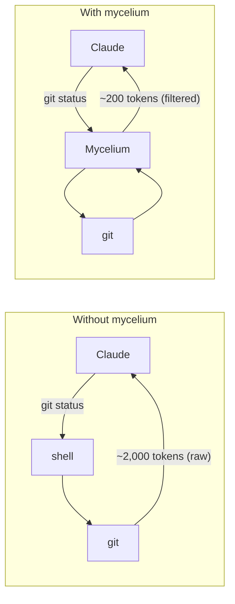

Mycelium:
---

mycelium filters and compresses command outputs before they reach your LLM context. Single Rust binary, zero dependencies, <10ms overhead.

## The Ecosystem

Mycelium is part of a fungal-themed suite of developer tools, named after the biology of fungi; a fitting metaphor for software that works quietly underground to connect and support what's above.

- **mycelium** — the vast underground network of filaments that feeds and connects. This tool: the connective tissue between your LLM and your dev environment, silently filtering everything that flows through.
- **[hyphae](https://github.com/basidiocarp/hyphae)** — the individual thread-like filaments that form mycelium. Fine-grained instrumentation and tracing.
- **[cap](https://github.com/basidiocarp/cap)** — the visible fruiting body above ground. The surface layer: dashboards, analytics, the part you actually see.

The tooling is written in Rust — a language that shares its name with another form of fungal life. Hence why it's called mycelium.

## Savings (30-min Claude Code Session)

| Operation                 | Frequency | Standard     | mycelium    | Savings  |
|---------------------------|-----------|--------------|-------------|----------|
| `ls` / `tree`             | 10x       | 2,000        | 400         | -80%     |
| `cat` / `read`            | 20x       | 40,000       | 12,000      | -70%     |
| `grep` / `rg`             | 8x        | 16,000       | 3,200       | -80%     |
| `git status`              | 10x       | 3,000        | 600         | -80%     |
| `git diff`                | 5x        | 10,000       | 2,500       | -75%     |
| `git log`                 | 5x        | 2,500        | 500         | -80%     |
| `git add/commit/push`     | 8x        | 1,600        | 120         | -92%     |
| `cargo test` / `npm test` | 5x        | 25,000       | 2,500       | -90%     |
| `ruff check`              | 3x        | 3,000        | 600         | -80%     |
| `pytest`                  | 4x        | 8,000        | 800         | -90%     |
| `go test`                 | 3x        | 6,000        | 600         | -90%     |
| `docker ps`               | 3x        | 900          | 180         | -80%     |
| **Total**                 |           | **~118,000** | **~23,900** | **-80%** |

> Estimates based on medium-sized TypeScript/Rust projects. Actual savings vary by project size.

## Installation

### Quick Install (Linux/macOS)

```bash
curl -fsSL install.sh | sh
```

> Installs to `~/.local/bin`. Add to PATH if needed:
> ```bash
> echo 'export PATH="$HOME/.local/bin:$PATH"' >> ~/.bashrc  # or ~/.zshrc
> ```

### Cargo

```bash
cargo install --git
```

### Pre-built Binaries

Download from [releases](https://github.com/basidiocarp/mycelium):
- macOS: `mycelium-x86_64-apple-darwin.tar.gz` / `mycelium-aarch64-apple-darwin.tar.gz`
- Linux: `mycelium-x86_64-unknown-linux-musl.tar.gz` / `mycelium-aarch64-unknown-linux-gnu.tar.gz`
- Windows: `mycelium-x86_64-pc-windows-msvc.zip`

### Verify Installation

```bash
mycelium --version   # Should show "mycelium 0.1.4"
mycelium gain        # Should show token savings stats
```
## Quick Start

```bash
# 1. Install hook for Claude Code (recommended)
mycelium init --global
# Follow instructions to register in ~/.claude/settings.json

# 2. Restart Claude Code, then test
git status  # Automatically rewritten to mycelium git status
```

The hook transparently rewrites commands (e.g., `git status` -> `mycelium git status`) before execution. Claude never sees the rewrite, it just gets compressed output.

## How It Works



Four strategies applied per command type:

1. **Smart Filtering** - Removes noise (comments, whitespace, boilerplate)
2. **Grouping** - Aggregates similar items (files by directory, errors by type)
3. **Truncation** - Keeps relevant context, cuts redundancy
4. **Deduplication** - Collapses repeated log lines with counts

## Commands

### Files
```bash
mycelium ls .                        # Token-optimized directory tree
mycelium read file.rs                # Smart file reading
mycelium read file.rs -l aggressive  # Signatures only (strips bodies)
mycelium smart file.rs               # 2-line heuristic code summary
mycelium find "*.rs" .               # Compact find results
mycelium grep "pattern" .            # Grouped search results
mycelium diff file1 file2            # Condensed diff
```

### Git
```bash
mycelium git status                  # Compact status
mycelium git log -n 10               # One-line commits
mycelium git diff                    # Condensed diff
mycelium git add                     # -> "ok"
mycelium git commit -m "msg"         # -> "ok abc1234"
mycelium git push                    # -> "ok main"
mycelium git pull                    # -> "ok 3 files +10 -2"
```

### GitHub CLI
```bash
mycelium gh pr list                  # Compact PR listing
mycelium gh pr view 42               # PR details + checks
mycelium gh issue list               # Compact issue listing
mycelium gh run list                 # Workflow run status
```

### Test Runners
```bash
mycelium test cargo test             # Show failures only (-90%)
mycelium err npm run build           # Errors/warnings only
mycelium vitest run                  # Vitest compact (failures only)
mycelium playwright test             # E2E results (failures only)
mycelium pytest                      # Python tests (-90%)
mycelium go test                     # Go tests (NDJSON, -90%)
mycelium cargo test                  # Cargo tests (-90%)
```

### Build & Lint
```bash
mycelium lint                        # ESLint grouped by rule/file
mycelium lint biome                  # Supports other linters
mycelium tsc                         # TypeScript errors grouped by file
mycelium next build                  # Next.js build compact
mycelium prettier --check .          # Files needing formatting
mycelium cargo build                 # Cargo build (-80%)
mycelium cargo clippy                # Cargo clippy (-80%)
mycelium ruff check                  # Python linting (JSON, -80%)
mycelium golangci-lint run           # Go linting (JSON, -85%)
```

### Package Managers
```bash
mycelium pnpm list                   # Compact dependency tree
mycelium pip list                    # Python packages (auto-detect uv)
mycelium pip outdated                # Outdated packages
mycelium prisma generate             # Schema generation (no ASCII art)
```

### Containers
```bash
mycelium docker ps                   # Compact container list
mycelium docker images               # Compact image list
mycelium docker logs <container>     # Deduplicated logs
mycelium docker compose ps           # Compose services
mycelium kubectl pods                # Compact pod list
mycelium kubectl logs <pod>          # Deduplicated logs
mycelium kubectl services            # Compact service list
```

### Data & Analytics
```bash
mycelium json config.json            # Structure without values
mycelium deps                        # Dependencies summary
mycelium env -f AWS                  # Filtered env vars
mycelium log app.log                 # Deduplicated logs
mycelium curl <url>                  # Auto-detect JSON + schema
mycelium wget <url>                  # Download, strip progress bars
mycelium summary <long command>      # Heuristic summary
mycelium proxy <command>             # Raw passthrough + tracking
```

### Token Savings Analytics
```bash
mycelium gain                        # Summary stats
mycelium gain --graph                # ASCII graph (last 30 days)
mycelium gain --history              # Recent command history
mycelium gain --daily                # Day-by-day breakdown
mycelium gain --all --format json    # JSON export for dashboards

mycelium discover                    # Find missed savings opportunities
mycelium discover --all --since 7    # All projects, last 7 days
```

## Global Flags

```bash
-u, --ultra-compact    # ASCII icons, inline format (extra token savings)
-v, --verbose          # Increase verbosity (-v, -vv, -vvv)
```

## Examples

**Directory listing:**
```
# ls -la (45 lines, ~800 tokens)        # mycelium ls (12 lines, ~150 tokens)
drwxr-xr-x  15 user staff 480 ...       my-project/
-rw-r--r--   1 user staff 1234 ...       +-- src/ (8 files)
...                                      |   +-- main.rs
                                         +-- Cargo.toml
```

**Git operations:**
```
# git push (15 lines, ~200 tokens)       # mycelium git push (1 line, ~10 tokens)
Enumerating objects: 5, done.             ok main
Counting objects: 100% (5/5), done.
Delta compression using up to 8 threads
...
```

**Test output:**
```
# cargo test (200+ lines on failure)     # mycelium test cargo test (~20 lines)
running 15 tests                          FAILED: 2/15 tests
test utils::test_parse ... ok               test_edge_case: assertion failed
test utils::test_format ... ok              test_overflow: panic at utils.rs:18
...
```

## Auto-Rewrite Hook

The most effective way to use mycelium. The hook transparently intercepts Bash commands and rewrites them to mycelium equivalents before execution.

**Result**: 100% mycelium adoption across all conversations and subagents, zero token overhead.

### Setup

```bash
mycelium init -g                 # Install hook + Mycelium.md (recommended)
mycelium init -g --auto-patch    # Non-interactive (CI/CD)
mycelium init -g --hook-only     # Hook only, no Mycelium.md
mycelium init --show             # Verify installation
```

After install, **restart Claude Code**.

### Commands Rewritten

| Raw Command                                | Rewritten To              |
|--------------------------------------------|---------------------------|
| `git status/diff/log/add/commit/push/pull` | `mycelium git ...`        |
| `gh pr/issue/run`                          | `mycelium gh ...`         |
| `cargo test/build/clippy`                  | `mycelium cargo ...`      |
| `cat/head/tail <file>`                     | `mycelium read <file>`    |
| `rg/grep <pattern>`                        | `mycelium grep <pattern>` |
| `ls`                                       | `mycelium ls`             |
| `vitest/jest`                              | `mycelium vitest run`     |
| `tsc`                                      | `mycelium tsc`            |
| `eslint/biome`                             | `mycelium lint`           |
| `prettier`                                 | `mycelium prettier`       |
| `playwright`                               | `mycelium playwright`     |
| `prisma`                                   | `mycelium prisma`         |
| `ruff check/format`                        | `mycelium ruff ...`       |
| `pytest`                                   | `mycelium pytest`         |
| `pip list/install`                         | `mycelium pip ...`        |
| `go test/build/vet`                        | `mycelium go ...`         |
| `golangci-lint`                            | `mycelium golangci-lint`  |
| `docker ps/images/logs`                    | `mycelium docker ...`     |
| `kubectl get/logs`                         | `mycelium kubectl ...`    |
| `curl`                                     | `mycelium curl`           |
| `pnpm list/outdated`                       | `mycelium pnpm ...`       |

Commands already using `mycelium`, heredocs (`<<`), and unrecognized commands pass through unchanged.

## Configuration

### Config File

`~/.config/mycelium/config.toml` (macOS: `~/Library/Application Support/mycelium/config.toml`):

```toml
[tracking]
database_path = "/path/to/custom.db"  # default: ~/.local/share/mycelium/history.db

[hooks]
exclude_commands = ["curl", "playwright"]  # skip rewrite for these

[tee]
enabled = true          # save raw output on failure (default: true)
mode = "failures"       # "failures", "always", or "never"
max_files = 20          # rotation limit
```


### Releasing

Use the release script to bump the version, run quality checks, and tag:

```bash
./scripts/release.sh v0.1.3
```

This will:
1. Update `Cargo.toml` and `Cargo.lock` with the new version
2. Run `cargo fmt --check`, `clippy`, and `test` as a gate
3. Commit the version bump and create an annotated git tag
4. Print the push command (does not push automatically)

### Uninstall

```bash
mycelium init -g --uninstall     # Remove hook, Mycelium.md, settings.json entry
cargo uninstall mycelium          # Remove binary
```

## Documentation

- **[TROUBLESHOOTING.md](docs/TROUBLESHOOTING.md)** – Fix common issues
- **[INSTALL.md](INSTALL.md)** - Detailed installation guide
- **[ARCHITECTURE.md](docs/ARCHITECTURE.md)** – Technical architecture
- **[SECURITY.md](SECURITY.md)** – Security policy and PR review process
- **[AUDIT_GUIDE.md](docs/AUDIT_GUIDE.md)** - Token savings analytics guide
