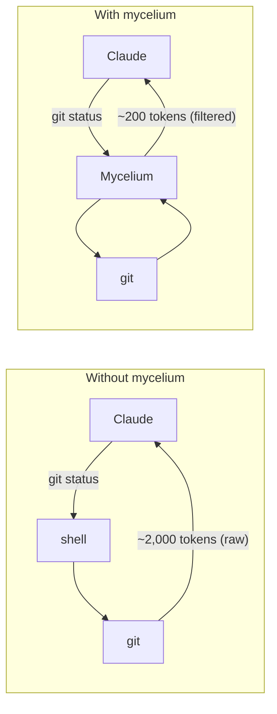

# Mycelium

Token-optimized CLI proxy. Filters and compresses command output before it reaches your LLM context. Single Rust binary, zero dependencies, <10ms overhead. 60-90% token savings on 70+ command types.

Part of the [Basidiocarp ecosystem](https://github.com/basidiocarp) — see the [Technical Overview](https://github.com/basidiocarp/.github/blob/main/profile/README.md#technical-overview) for how Mycelium fits with Hyphae, Rhizome, Cap, and Lamella.

`stipe` owns onboarding and repair for the ecosystem. Mycelium handles the lower-level filtering and integration work that those flows depend on.

## The Ecosystem

- **mycelium** — Filters and compresses command output (this project). See [Token Optimization](https://github.com/basidiocarp/.github/blob/main/profile/README.md#token-optimization--mycelium).
- **[hyphae](https://github.com/basidiocarp/hyphae)** — Persistent memory with [RAG pipeline](https://github.com/basidiocarp/.github/blob/main/profile/README.md#retrieval-augmented-generation-rag--hyphae--lamella), [vector search](https://github.com/basidiocarp/.github/blob/main/profile/README.md#vector-database--hybrid-search--hyphae), and [feedback loop](https://github.com/basidiocarp/.github/blob/main/profile/README.md#feedback-loop--lesson-extraction--hyphae--lamella).
- **[rhizome](https://github.com/basidiocarp/rhizome)** — Code intelligence with [tree-sitter](https://github.com/basidiocarp/.github/blob/main/profile/README.md#tree-sitter-code-parsing--rhizome) and [LSP auto-management](https://github.com/basidiocarp/.github/blob/main/profile/README.md#lsp-auto-management--rhizome).
- **[cap](https://github.com/basidiocarp/cap)** — Web dashboard for memory browsing, token analytics, and code exploration.
- **[lamella](https://github.com/basidiocarp/lamella)** — Skills, hooks, and [feedback capture](https://github.com/basidiocarp/.github/blob/main/profile/README.md#feedback-loop--lesson-extraction--hyphae--lamella) for Claude Code.

## Savings (30-min Claude Code Session)

| Operation                 | Frequency | Standard     | mycelium    | Savings  |
|---------------------------|-----------|--------------|-------------|----------|
| `ls` / `tree`             | 10x       | 2,000        | 400         | -80%     |
| `cat` / `read`            | 20x       | 40,000       | 12,000      | -70%     |
| `grep` / `rg`             | 8x        | 16,000       | 3,200       | -80%     |
| `git status`              | 10x       | 3,000        | 600         | -80%     |
| `git diff`                | 5x        | 10,000       | 2,500       | -75%     |
| `git log`                 | 5x        | 2,500        | 500         | -80%     |
| `git add/commit/push`     | 8x        | 1,600        | 120         | -92%     |
| `cargo test` / `npm test` | 5x        | 25,000       | 2,500       | -90%     |
| `ruff check`              | 3x        | 3,000        | 600         | -80%     |
| `pytest`                  | 4x        | 8,000        | 800         | -90%     |
| `go test`                 | 3x        | 6,000        | 600         | -90%     |
| `docker ps`               | 3x        | 900          | 180         | -80%     |
| **Total**                 |           | **~118,000** | **~23,900** | **-80%** |

## Installation

```bash
# Quick install (all ecosystem tools)
curl -fsSL https://raw.githubusercontent.com/basidiocarp/.github/main/install.sh | sh

# Onboarding and repair
stipe init

# Install Mycelium
cargo install --git https://github.com/basidiocarp/mycelium

# Lower-level integration after Stipe has onboarded the ecosystem
mycelium init --ecosystem
```

## How It Works



### Filtering Strategies

1. **Smart filtering** — Removes noise (comments, whitespace, boilerplate)
2. **Grouping** — Aggregates similar items (files by directory, errors by type)
3. **Truncation** — Keeps relevant context, cuts redundancy
4. **Deduplication** — Collapses repeated log lines with counts
5. **Adaptive sizing** — Small (<50 lines) pass through, medium get filtered, large (>500 lines) get full compression
6. **Hyphae routing** — Large outputs stored as retrievable chunks in Hyphae (when installed)
7. **Rhizome code intelligence** — `mycelium read` uses tree-sitter structural outlines for large code files (when installed)

### Ecosystem Integration

Mycelium is also the ecosystem orchestrator:
- `mycelium init --ecosystem` — lower-level integration that detects tools, registers MCP servers, installs hooks, and initializes databases
- `stipe init` — primary onboarding and repair entry point for the ecosystem
- Installs **Hyphae capture hooks** (errors, corrections, test results, code changes) into `~/.claude/hooks/`
- Persistent Hyphae connection with auto-reconnect for large output chunking
- Session summary hook captures task description, files modified, tools used, errors resolved

## Documentation

- [FEATURES.md](docs/FEATURES.md) — Feature overview and savings summary
- [COMMANDS.md](docs/COMMANDS.md) — Complete command reference (70+ commands)
- [ANALYTICS.md](docs/ANALYTICS.md) — Token savings analytics and hooks
- [ARCHITECTURE.md](docs/ARCHITECTURE.md) — Technical architecture
- [EXTENDING.md](docs/EXTENDING.md) — Adding new commands
- [PLUGINS.md](docs/PLUGINS.md) — Custom filter plugins
- [TROUBLESHOOTING.md](docs/TROUBLESHOOTING.md) — Common issues

## License

MIT
