# Mycelium Architecture Documentation

> **Mycelium** - A high-performance CLI proxy that minimizes LLM token consumption through intelligent output filtering and compression.

This document provides a comprehensive architectural overview of Mycelium, including system design, data flows, module organization, and implementation patterns.

---

## Table of Contents

1. [System Overview](#system-overview)
2. [Command Lifecycle](#command-lifecycle)
3. [Module Organization](#module-organization)
4. [Filtering Strategies](#filtering-strategies)
5. [Shared Infrastructure](#shared-infrastructure)
6. [Token Tracking System](#token-tracking-system)
7. [Global Flags Architecture](#global-flags-architecture)
8. [Error Handling](#error-handling)
9. [Configuration System](#configuration-system)
10. [Module Development Pattern](#module-development-pattern)
11. [Build Optimizations](#build-optimizations)
12. [Extensibility Guide](#extensibility-guide)

---

## System Overview

### Proxy Pattern Architecture

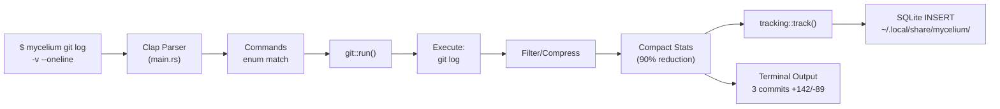

### Key Components

| Component            | Location                                           | Responsibility                                     |
|----------------------|----------------------------------------------------|----------------------------------------------------|
| **CLI Parser**       | main.rs, commands.rs                               | Clap-based argument parsing, global flags          |
| **Command Router**   | main.rs, dispatch.rs                               | Dispatch to specialized modules                    |
| **Module Layer**     | src/*_cmd.rs, src/vcs/, src/js/, etc.              | Command execution + filtering                      |
| **Shared Utils**     | utils.rs                                           | Package manager detection, text processing         |
| **Filter Engine**    | filter.rs                                          | Language-aware code filtering                      |
| **Parser Framework** | parser/ (mod.rs, types.rs, formatter.rs)           | OutputParser trait, ParseResult<T>, TokenFormatter |
| **Tracking**         | tracking/ (mod.rs, queries.rs, timer.rs, utils.rs) | SQLite-based token metrics                         |
| **Analytics**        | gain/, discover/, learn/, cc_economics/            | Token savings analysis and reporting               |
| **Config**           | config.rs, init/                                   | User preferences, LLM integration                  |

### Design Principles

1. **Single Responsibility**: Each module handles one command type
2. **Minimal Overhead**: ~5-15ms proxy overhead per command
3. **Exit Code Preservation**: CI/CD reliability through proper exit code propagation
4. **Fail-Safe**: If filtering fails, fall back to original output
5. **Transparent**: Users can always see raw output with `-v` flags

### Hook Architecture (v0.9.5+)

The recommended deployment mode uses a Claude Code PreToolUse hook for 100% transparent command rewriting.

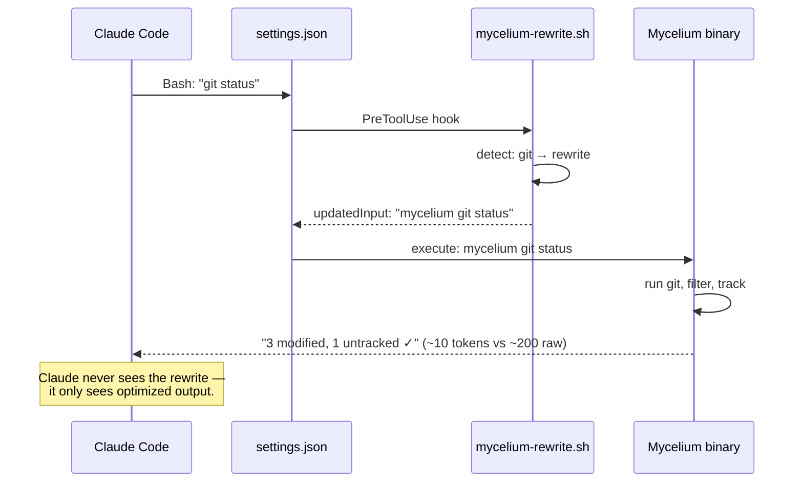

**Installed files:**
| File | Purpose |
|------|---------|
| `~/.claude/hooks/mycelium-rewrite.sh` | Thin delegator (calls `mycelium rewrite`, ~50 lines) |
| `~/.claude/settings.json` | Hook registry (PreToolUse registration) |
| `~/.claude/Mycelium.md` | Minimal context hint (10 lines) |

Two hook strategies:

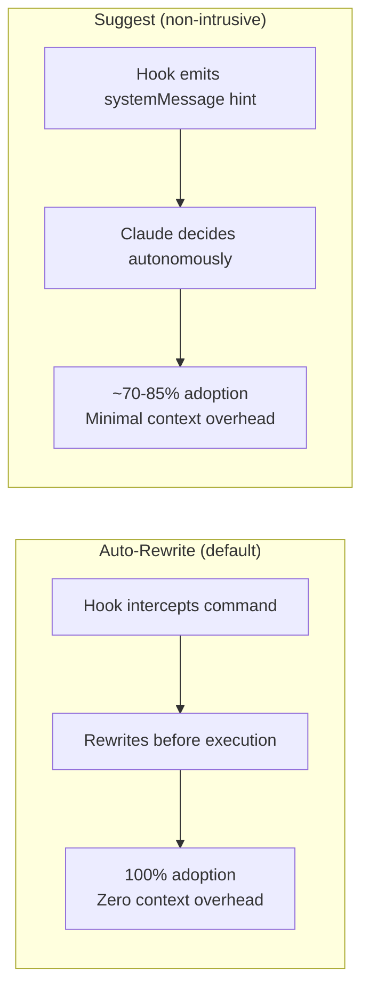

---

## Command Lifecycle

### Six-Phase Execution Flow

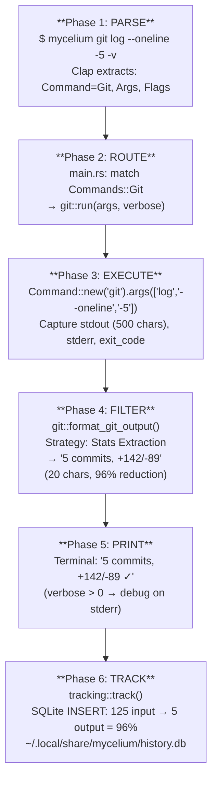

### Verbosity Levels

```
-v (Level 1): Show debug messages
  Example: eprintln!("Git log summary:");

-vv (Level 2): Show command being executed
  Example: eprintln!("Executing: git log --oneline -5");

-vvv (Level 3): Show raw output before filtering
  Example: eprintln!("Raw output:\n{}", stdout);
```

---

## Module Organization

### Complete Module Map (30 Modules)

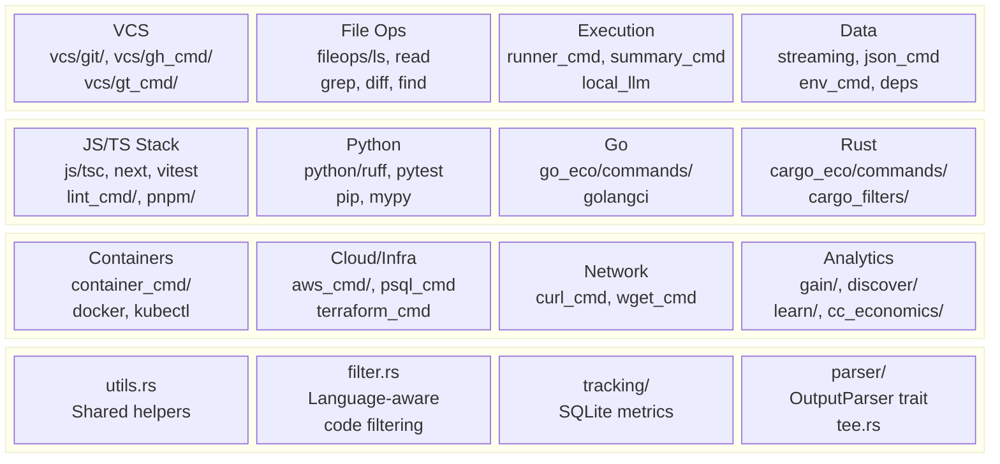

| Category | Directory/Module | Commands | Savings |
|----------|-----------------|----------|---------|
| **Git (VCS)** | `vcs/git/`, `vcs/git_filters/` | status, diff, log, add, commit, push | 85-99% |
| **Code Search** | `fileops/grep_cmd.rs`, `diff_cmd.rs`, `find_cmd.rs` | grep, diff, find | 50-85% |
| **File Ops** | `fileops/ls.rs`, `read.rs` | ls, read | 40-90% |
| **Execution** | `runner_cmd.rs`, `summary_cmd.rs` | err, test, smart | 50-99% |
| **Logs/Data** | `streaming.rs`, `json_cmd.rs` | log, json | 70-95% |
| **JS/TS** | `js/`, `lint_cmd/` | tsc, next, vitest, lint, prettier, playwright, prisma, pnpm | 70-99% |
| **Python** | `python/` | ruff, pytest, pip, mypy | 70-90% |
| **Go** | `go_eco/` | go test/build/vet, golangci-lint | 75-90% |
| **Rust** | `cargo_eco/`, `cargo_filters/` | cargo build/test/clippy/check | 80-90% |
| **Containers** | `container_cmd/` | docker, kubectl | 60-80% |
| **Network** | `wget_cmd.rs`, `curl_cmd.rs` | wget, curl | 70-95% |
| **Infra** | `aws_cmd/`, `psql_cmd.rs`, `terraform_cmd.rs` | aws, psql, terraform | 75-80% |
| **GitHub CLI** | `vcs/gh_cmd/`, `vcs/gh_pr/` | gh pr/issue/run | 26-87% |
| **Analytics** | `gain/`, `discover/`, `learn/`, `cc_economics/` | gain, discover, learn, cc-economics | N/A |
| **Shared** | `utils.rs`, `filter.rs`, `tracking/`, `parser/`, `tee.rs` | (infrastructure) | N/A |

**Total: 60+ modules** across 17 directories

### Module Count Breakdown

- **Command Modules**: 40+ (directly exposed to users)
- **Infrastructure Modules**: 20+ (utils, filter, tracking, tee, config, init, gain, parser, etc.)
- **Git/VCS Commands**: 7 git operations + gh + gt (stacked PRs)
- **JS/TS Tooling**: 8 modules in `js/` + `lint_cmd/` (modern frontend/fullstack development)
- **Python Tooling**: 4 modules in `python/` + `lint_cmd/pylint.rs` (ruff, pytest, pip, mypy)
- **Go Tooling**: 2 modules in `go_eco/` (go test/build/vet, golangci-lint)
- **Analytics**: 4 modules (gain, discover, learn, cc-economics)
- **Parser Framework**: `parser/` with OutputParser trait, ParseResult<T>, TokenFormatter

---

## Filtering Strategies

### Strategy Matrix

```mermaid
flowchart LR
    subgraph Strategies["12 Filtering Strategies"]
        direction TB
        S1["1. Stats Extraction\n90-99%"]
        S2["2. Error Only\n60-80%"]
        S3["3. Group by Pattern\n80-90%"]
        S4["4. Deduplication\n70-85%"]
        S5["5. Structure Only\n80-95%"]
        S6["6. Code Filtering\n0-90%"]
        S7["7. Failure Focus\n94-99%"]
        S8["8. Tree Compression\n50-70%"]
        S9["9. Progress Filtering\n85-95%"]
        S10["10. JSON/Text Dual\n80%+"]
        S11["11. State Machine\n90%+"]
        S12["12. NDJSON Streaming\n90%+"]
    end
```

| # | Strategy | Technique | Reduction | Used By |
|---|----------|-----------|-----------|---------|
| 1 | **Stats Extraction** | Count/aggregate, drop details | 90-99% | git status, git log, git diff, pnpm list |
| 2 | **Error Only** | stderr only, drop stdout | 60-80% | runner (err mode), test failures |
| 3 | **Grouping by Pattern** | Group by rule, count/summarize | 80-90% | lint, tsc, grep (by file/rule/error code) |
| 4 | **Deduplication** | Unique lines + count | 70-85% | log_cmd (pattern identification) |
| 5 | **Structure Only** | Keys + types, strip values | 80-95% | json_cmd (schema extraction) |
| 6 | **Code Filtering** | none/minimal/aggressive levels | 0-90% | read, smart (language-aware via filter.rs) |
| 7 | **Failure Focus** | Failures only, hide passing | 94-99% | vitest, playwright, runner (test mode) |
| 8 | **Tree Compression** | Tree hierarchy, aggregate dirs | 50-70% | ls (directory tree with counts) |
| 9 | **Progress Filtering** | Strip ANSI bars, final result | 85-95% | wget, pnpm install |
| 10 | **JSON/Text Dual** | JSON when available, text fallback | 80%+ | ruff (check→JSON, format→text), pip |
| 11 | **State Machine** | Track test lifecycle states | 90%+ | pytest (IDLE→TEST_START→PASSED/FAILED) |
| 12 | **NDJSON Streaming** | Line-by-line JSON parse, aggregate | 90%+ | go test (interleaved package events) |

### Code Filtering Levels (filter.rs)

```rust
// FilterLevel::None - Keep everything
fn calculate_total(items: &[Item]) -> i32 {
    // Sum all items
    items.iter().map(|i| i.value).sum()
}

// FilterLevel::Minimal - Strip comments only (20-40% reduction)
fn calculate_total(items: &[Item]) -> i32 {
    items.iter().map(|i| i.value).sum()
}

// FilterLevel::Aggressive - Strip comments + function bodies (60-90% reduction)
fn calculate_total(items: &[Item]) -> i32 { ... }
```

**Language Support**: Rust, Python, JavaScript, TypeScript, Go, C, C++, Java

**Detection**: File extension-based with fallback heuristics

---

## Python & Go Module Architecture

### Design Rationale

**Added**: 2026-02-12 (v0.15.1)
**Motivation**: Complete language ecosystem coverage beyond JS/TS

Python and Go modules follow distinct architectural patterns optimized for their ecosystems:

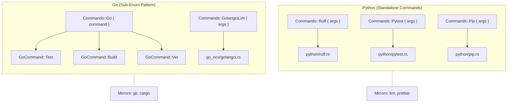

### Python Stack Architecture

#### Command Implementations

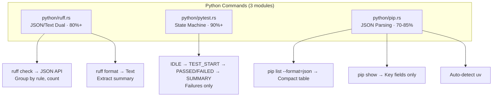

#### Shared Infrastructure

**No Package Manager Detection**
Unlike JS/TS modules, Python commands don't auto-detect poetry/pipenv/pip because:
- `pip` is universally available (system Python)
- `uv` detection is explicit (binary presence check)
- Poetry/pipenv aren't execution wrappers (they manage virtualenvs differently)

**Virtual Environment Awareness**
Commands respect active virtualenv via `sys.executable` paths.

### Go Stack Architecture

#### Command Implementations

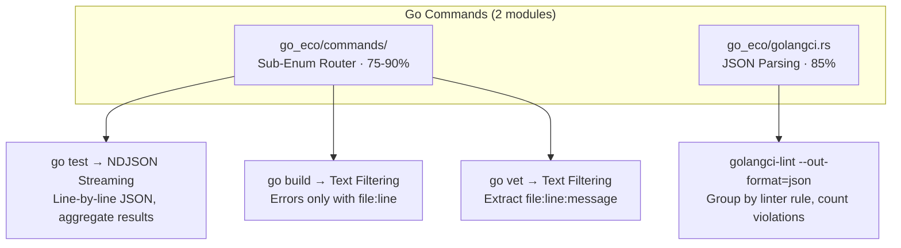

#### Sub-Enum Pattern (go_eco/commands/)

```rust
// main.rs enum definition
Commands::Go {
    #[command(subcommand)]
    command: GoCommand,
}

// go_eco/commands/ sub-enum
pub enum GoCommand {
    Test { args: Vec<String> },
    Build { args: Vec<String> },
    Vet { args: Vec<String> },
}

// Router
pub fn run(command: &GoCommand, verbose: u8) -> Result<()> {
    match command {
        GoCommand::Test { args } => run_test(args, verbose),
        GoCommand::Build { args } => run_build(args, verbose),
        GoCommand::Vet { args } => run_vet(args, verbose),
    }
}
```

**Why Sub-Enum?**
- `go test/build/vet` are semantically related (core Go toolchain)
- Mirrors existing git/cargo patterns (consistency)
- Natural CLI: `mycelium go test` not `mycelium gotest`

**Why golangci-lint Standalone?**
- Third-party tool (not core Go toolchain)
- Different output format (JSON API vs text)
- Distinct use case (comprehensive linting vs single-tool diagnostics)

### Format Strategy Decision Tree

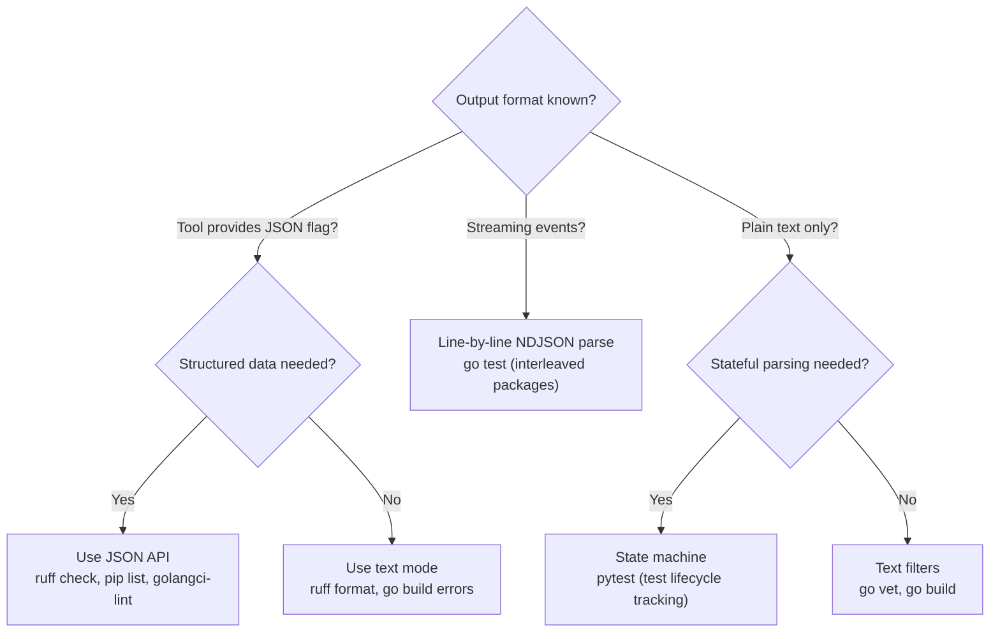

### Testing Patterns

#### Python Module Tests

```rust
// python/pytest.rs tests
#[test]
fn test_pytest_state_machine() {
    let output = "test_auth.py::test_login PASSED\ntest_db.py::test_query FAILED";
    let result = parse_pytest_output(output);
    assert!(result.contains("1 failed"));
    assert!(result.contains("test_db.py::test_query"));
}
```

#### Go Module Tests

```rust
// go_eco/commands/ tests
#[test]
fn test_go_test_ndjson_interleaved() {
    let output = r#"{"Action":"run","Package":"pkg1"}
{"Action":"fail","Package":"pkg1","Test":"TestA"}
{"Action":"run","Package":"pkg2"}
{"Action":"pass","Package":"pkg2","Test":"TestB"}"#;

    let result = parse_go_test_ndjson(output);
    assert!(result.contains("pkg1: 1 failed"));
    assert!(!result.contains("pkg2")); // pkg2 passed, hidden
}
```

### Performance Characteristics

| Command | Raw Time | Mycelium Time | Overhead | Savings |
|---------|----------|---------------|----------|---------|
| `ruff check` | 850ms | 862ms | +12ms | 83% |
| `pytest` | 1.2s | 1.21s | +10ms | 92% |
| `pip list` | 450ms | 458ms | +8ms | 78% |
| `go test` | 2.1s | 2.12s | +20ms | 88% |
| `go build` (errors) | 950ms | 961ms | +11ms | 80% |
| `golangci-lint` | 4.5s | 4.52s | +20ms | 85% |

**Overhead sources:** JSON parsing (5-10ms), state machine (3-8ms), NDJSON streaming (8-15ms)

### Module Integration Checklist

When adding Python/Go module support:

- [x] **Output Format**: JSON API > NDJSON > State Machine > Text Filters
- [x] **Failure Focus**: Hide passing tests, show failures only
- [x] **Exit Code Preservation**: Propagate tool exit codes for CI/CD
- [x] **Virtual Env Awareness**: Python modules respect active virtualenv
- [x] **Error Grouping**: Group by rule/file for linters (ruff, golangci-lint)
- [x] **Streaming Support**: Handle interleaved NDJSON events (go test)
- [x] **Verbosity Levels**: Support -v/-vv/-vvv for debug output
- [x] **Token Tracking**: Integrate with tracking::track()
- [x] **Unit Tests**: Test parsing logic with representative outputs

---

## Shared Infrastructure

### Utilities Layer (utils.rs)

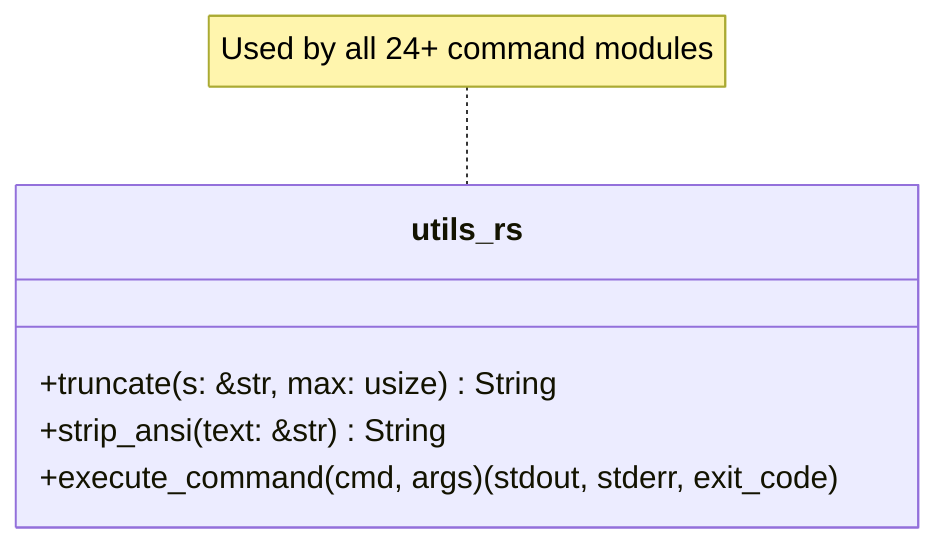

### Package Manager Detection Pattern

**Critical Infrastructure for JS/TS Stack (8 modules)**

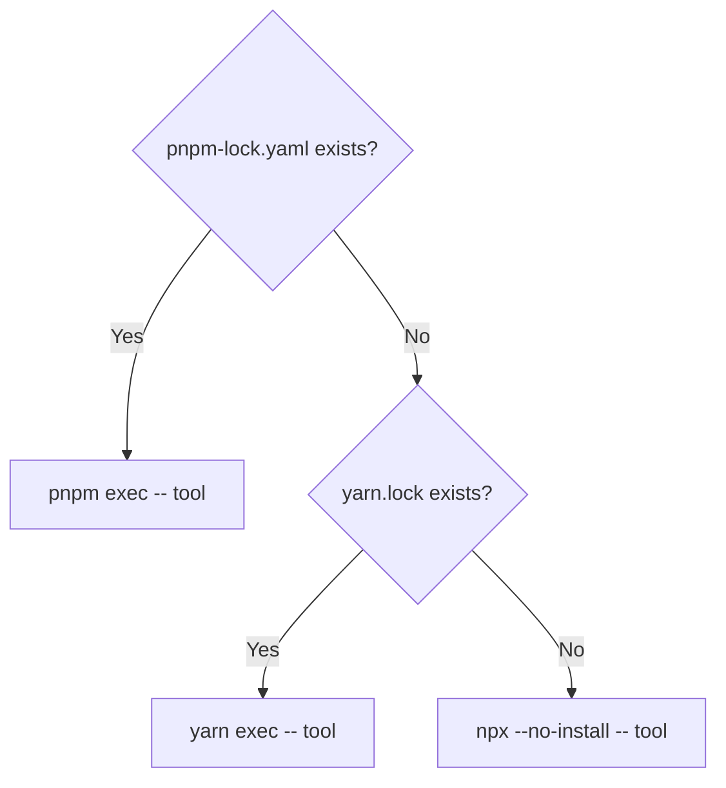

Affects: lint, tsc, next, prettier, playwright, prisma, vitest, pnpm

**Why This Matters**:
- **CWD Preservation**: pnpm/yarn exec preserve working directory correctly
- **Monorepo Support**: Works in nested package.json structures
- **No Global Installs**: Uses project-local dependencies only
- **CI/CD Reliability**: Consistent behavior across environments

---

## Token Tracking System

### SQLite-Based Metrics

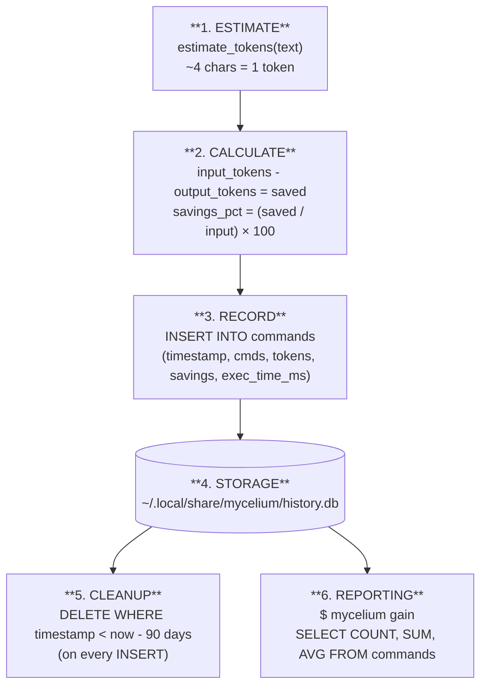

**Schema: `commands` table**

| Column | Type | Description |
|--------|------|-------------|
| `id` | INTEGER PRIMARY KEY | Auto-increment |
| `timestamp` | TEXT NOT NULL | RFC3339 UTC |
| `original_cmd` | TEXT NOT NULL | e.g., "git log --oneline -5" |
| `mycelium_cmd` | TEXT NOT NULL | e.g., "mycelium git log --oneline -5" |
| `input_tokens` | INTEGER NOT NULL | Estimated input tokens |
| `output_tokens` | INTEGER NOT NULL | Actual output tokens |
| `saved_tokens` | INTEGER NOT NULL | input - output |
| `savings_pct` | REAL NOT NULL | (saved / input) × 100 |
| `exec_time_ms` | INTEGER DEFAULT 0 | Execution duration (added v0.7.1) |

### Thread Safety

```rust
// tracking.rs:9-11
lazy_static::lazy_static! {
    static ref TRACKER: Mutex<Option<Tracker>> = Mutex::new(None);
}
```

**Design**: Single-threaded execution with Mutex for future-proofing.
**Current State**: No multi-threading, but Mutex enables safe concurrent access if needed.

---

## Global Flags Architecture

### Verbosity System

| Flag | Level | Behavior |
|------|-------|----------|
| (none) | 0 | Compact output only |
| `-v` | 1 | + Debug messages (`eprintln!` statements) |
| `-vv` | 2 | + Command being executed |
| `-vvv` | 3 | + Raw output before filtering |

### Ultra-Compact Mode (`-u`)

Activates maximum compression for LLM contexts:
- ASCII icons instead of words (✓ ✗ → ⚠)
- Inline formatting (single-line summaries)
- Maximum token reduction

```rust
// Example (gh_cmd.rs)
if ultra_compact {
    println!("✓ PR #{} merged", number);
} else {
    println!("Pull request #{} successfully merged", number);
}
```

---

## Error Handling

### anyhow::Result<()> Propagation Chain

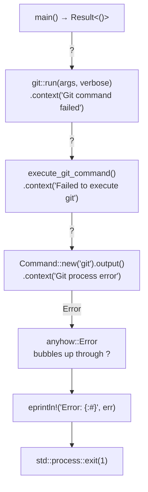

### Exit Code Preservation (Critical for CI/CD)

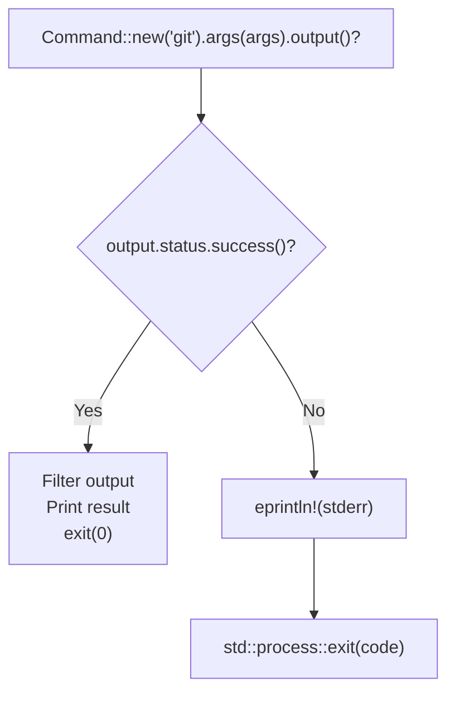

| Exit Code | Meaning |
|-----------|---------|
| `0` | Success |
| `1` | Mycelium internal error (parsing, filtering, etc.) |
| `N` | Preserved exit code from underlying tool (e.g., git=128, lint=1) |

**Why this matters:** CI/CD pipelines, pre-commit hooks, and git workflows rely on accurate exit codes.

**Modules with exit code preservation:** git.rs, lint_cmd.rs, tsc_cmd.rs, vitest_cmd.rs, playwright_cmd.rs

---

## Configuration System

### Two-Tier Configuration

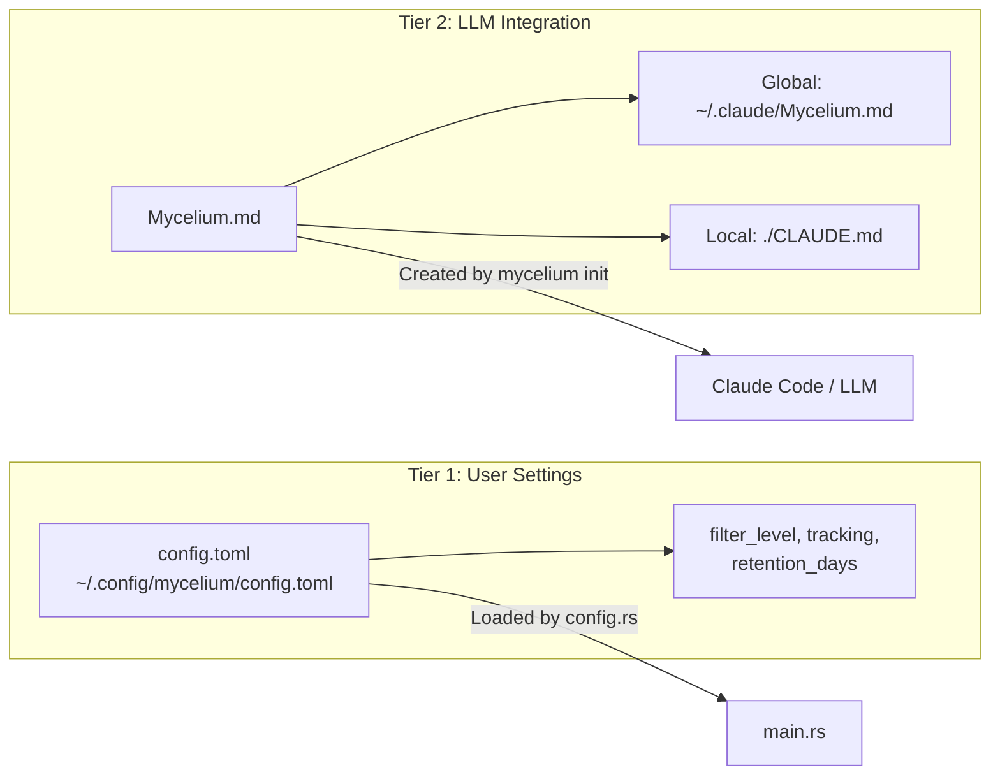

### Initialization Flow

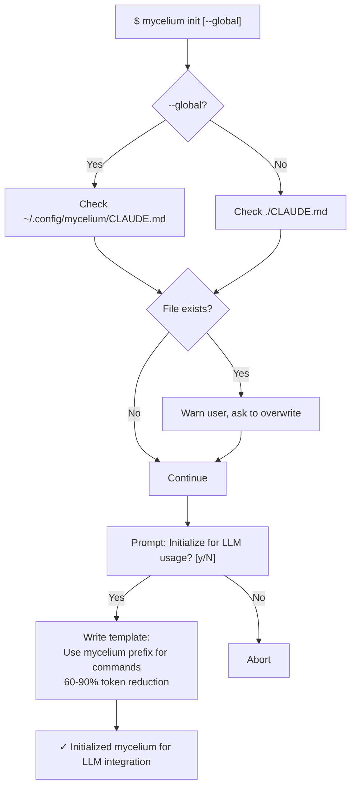

---

## Module Development Pattern

### Standard Module Template

```rust
// src/example_cmd.rs

use anyhow::{Context, Result};
use std::process::Command;
use crate::{tracking, utils};

/// Public entry point called by main.rs router
pub fn run(args: &[String], verbose: u8) -> Result<()> {
    // 1. Execute underlying command
    let raw_output = execute_command(args)?;

    // 2. Apply filtering strategy
    let filtered = filter_output(&raw_output, verbose);

    // 3. Print result
    println!("{}", filtered);

    // 4. Track token savings
    tracking::track(
        "original_command",
        "mycelium command",
        &raw_output,
        &filtered
    );

    Ok(())
}

/// Execute the underlying tool
fn execute_command(args: &[String]) -> Result<String> {
    let output = Command::new("tool")
        .args(args)
        .output()
        .context("Failed to execute tool")?;

    // Preserve exit codes (critical for CI/CD)
    if !output.status.success() {
        let stderr = String::from_utf8_lossy(&output.stderr);
        eprintln!("{}", stderr);
        std::process::exit(output.status.code().unwrap_or(1));
    }

    Ok(String::from_utf8_lossy(&output.stdout).to_string())
}

/// Apply filtering strategy
fn filter_output(raw: &str, verbose: u8) -> String {
    // Choose strategy: stats, grouping, deduplication, etc.
    // See "Filtering Strategies" section for options

    if verbose >= 3 {
        eprintln!("Raw output:\n{}", raw);
    }

    // Apply compression logic
    let compressed = compress(raw);

    compressed
}

#[cfg(test)]
mod tests {
    use super::*;

    #[test]
    fn test_filter_output() {
        let raw = "verbose output here";
        let filtered = filter_output(raw, 0);
        assert!(filtered.len() < raw.len());
    }
}
```

### Common Patterns

#### 1. Package Manager Detection (JS/TS modules)

```rust
// Detect lockfiles
let is_pnpm = Path::new("pnpm-lock.yaml").exists();
let is_yarn = Path::new("yarn.lock").exists();

// Build command
let mut cmd = if is_pnpm {
    Command::new("pnpm").arg("exec").arg("--").arg("eslint")
} else if is_yarn {
    Command::new("yarn").arg("exec").arg("--").arg("eslint")
} else {
    Command::new("npx").arg("--no-install").arg("--").arg("eslint")
};
```

#### 2. Lazy Static Regex (filter.rs, runner.rs)

```rust
lazy_static::lazy_static! {
    static ref PATTERN: Regex = Regex::new(r"ERROR:.*").unwrap();
}

// Usage: compiled once, reused across invocations
let matches: Vec<_> = PATTERN.find_iter(text).collect();
```

#### 3. Verbosity Guards

```rust
if verbose > 0 {
    eprintln!("Debug: Processing {} files", count);
}

if verbose >= 2 {
    eprintln!("Executing: {:?}", cmd);
}

if verbose >= 3 {
    eprintln!("Raw output:\n{}", raw);
}
```

---

## Build Optimizations

### Release Profile (Cargo.toml)

```toml
[profile.release]
opt-level = 3          # Maximum optimization
lto = true             # Link-time optimization
codegen-units = 1      # Single codegen unit for better optimization
strip = true           # Remove debug symbols
panic = "abort"        # Smaller binary size
```

### Performance Characteristics

**Binary:**
- Size: ~4.1 MB (stripped release build)
- Startup: ~5-10ms (cold start)
- Memory: ~2-5 MB (typical usage)

**Runtime overhead (estimated):**

| Operation | Mycelium Overhead | Total Time |
|-----------|-------------------|------------|
| `mycelium git status` | +8ms | 58ms |
| `mycelium grep "pattern"` | +12ms | 145ms |
| `mycelium read file.rs` | +5ms | 15ms |
| `mycelium lint` | +15ms | 2.5s |

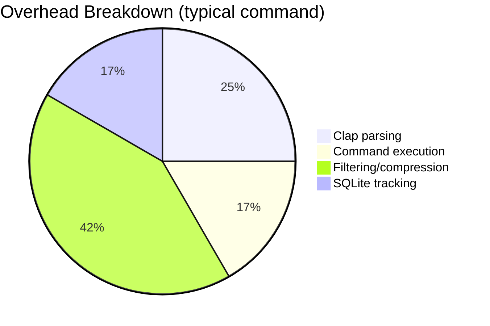

### Compilation

```bash
# Development build (fast compilation, debug symbols)
cargo build

# Release build (optimized, stripped)
cargo build --release

# Check without building (fast feedback)
cargo check

# Run tests
cargo test

# Lint with clippy
cargo clippy --all-targets

# Format code
cargo fmt
```

---

## Extensibility Guide

### Adding a New Command

**Step-by-step process to add a new mycelium command:**

#### 1. Create Module File

```bash
touch src/mycmd.rs
```

#### 2. Implement Module (src/mycmd.rs)

```rust
use anyhow::{Context, Result};
use std::process::Command;
use crate::tracking;

pub fn run(args: &[String], verbose: u8) -> Result<()> {
    // Execute underlying command
    let output = Command::new("mycmd")
        .args(args)
        .output()
        .context("Failed to execute mycmd")?;

    let raw = String::from_utf8_lossy(&output.stdout);

    // Apply filtering strategy
    let filtered = filter(&raw, verbose);

    // Print result
    println!("{}", filtered);

    // Track savings
    tracking::track("mycmd", "mycelium mycmd", &raw, &filtered);

    Ok(())
}

fn filter(raw: &str, verbose: u8) -> String {
    // Implement your filtering logic
    raw.lines().take(10).collect::<Vec<_>>().join("\n")
}

#[cfg(test)]
mod tests {
    use super::*;

    #[test]
    fn test_filter() {
        let raw = "line1\nline2\n";
        let result = filter(raw, 0);
        assert!(result.contains("line1"));
    }
}
```

#### 3. Declare Module (main.rs)

```rust
// Add to module declarations (alphabetically)
mod mycmd;
```

#### 4. Add Command Enum Variant (main.rs)

```rust
#[derive(Subcommand)]
enum Commands {
    // ... existing commands ...

    /// Description of your command
    Mycmd {
        /// Arguments your command accepts
        #[arg(trailing_var_arg = true, allow_hyphen_values = true)]
        args: Vec<String>,
    },
}
```

#### 5. Add Router Match Arm (main.rs)

```rust
match cli.command {
    // ... existing matches ...

    Commands::Mycmd { args } => {
        mycmd::run(&args, verbose)?;
    }
}
```

#### 6. Test Your Command

```bash
# Build and test
cargo build
./target/debug/mycelium mycmd arg1 arg2

# Run tests
cargo test mycmd::tests

# Check with clippy
cargo clippy --all-targets
```

#### 7. Document Your Command

Update CLAUDE.md:

```markdown
### New Commands

**mycelium mycmd** - Description of what it does
- Strategy: [stats/grouping/filtering/etc.]
- Savings: X-Y%
- Used by: [workflow description]
```

### Design Checklist

When implementing a new command, consider:

- [ ] **Filtering Strategy**: Which of the 9 strategies fits best?
- [ ] **Exit Code Preservation**: Does your command need to preserve exit codes for CI/CD?
- [ ] **Verbosity Support**: Add debug output for `-v`, `-vv`, `-vvv`
- [ ] **Error Handling**: Use `.context()` for meaningful error messages
- [ ] **Package Manager Detection**: For JS/TS tools, use the standard detection pattern
- [ ] **Tests**: Add unit tests for filtering logic
- [ ] **Token Tracking**: Integrate with `tracking::track()`
- [ ] **Documentation**: Update CLAUDE.md with token savings and use cases

---

## Architecture Decision Records

### Why Rust?

- **Performance**: ~5-15ms overhead per command (negligible for user experience)
- **Safety**: No runtime errors from null pointers, data races, etc.
- **Single Binary**: No runtime dependencies (distribute one executable)
- **Cross-Platform**: Works on macOS, Linux, Windows without modification

### Why SQLite for Tracking?

- **Zero Config**: No server setup, works out-of-the-box
- **Lightweight**: ~100KB database for 90 days of history
- **Reliable**: ACID compliance for data integrity
- **Queryable**: Rich analytics via SQL (gain report)

### Why anyhow for Error Handling?

- **Context**: `.context()` adds meaningful error messages throughout call chain
- **Ergonomic**: `?` operator for concise error propagation
- **User-Friendly**: Error display shows full context chain

### Why Clap for CLI Parsing?

- **Derive Macros**: Less boilerplate (declarative CLI definition)
- **Auto-Generated Help**: `--help` generated automatically
- **Type Safety**: Parse arguments directly into typed structs
- **Global Flags**: `-v` and `-u` work across all commands

---

## Resources

- **README.md**: User guide, installation, examples
- **CLAUDE.md**: Developer documentation, module details, PR history
- **Cargo.toml**: Dependencies, build profiles, package metadata
- **src/**: Source code organized by module
- **.github/workflows/**: CI/CD automation (multi-platform builds, releases)

---

## Glossary

| Term | Definition |
|------|------------|
| **Token** | Unit of text processed by LLMs (~4 characters on average) |
| **Filtering** | Reducing output size while preserving essential information |
| **Proxy Pattern** | mycelium sits between user and tool, transforming output |
| **Exit Code Preservation** | Passing through tool's exit code for CI/CD reliability |
| **Package Manager Detection** | Identifying pnpm/yarn/npm to execute JS/TS tools correctly |
| **Verbosity Levels** | `-v/-vv/-vvv` for progressively more debug output |
| **Ultra-Compact** | `-u` flag for maximum compression (ASCII icons, inline format) |
