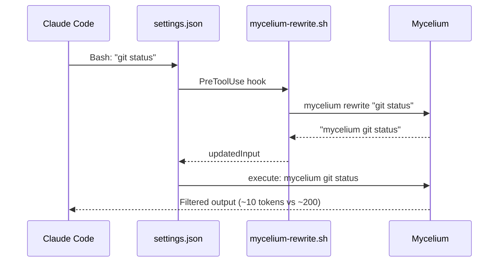

# Mycelium - Complete Feature Documentation

> **Mycelium** -- High-performance CLI proxy that reduces LLM token consumption by 60 to 90%.

Single Rust binary, zero external dependencies, overhead < 10ms per command.

---

## Table of Contents

1. [Overview](#overview)
2. [Global Flags](#global-flags)
3. [File Commands](#file-commands)
4. [Git Commands](#git-commands)
5. [GitHub CLI Commands](#github-cli-commands)
6. [Test Commands](#test-commands)
7. [Build and Lint Commands](#build-and-lint-commands)
8. [Formatting Commands](#formatting-commands)
9. [Package Managers](#package-managers)
10. [Containers and Orchestration](#containers-and-orchestration)
11. [Data and Network](#data-and-network)
12. [Cloud and Databases](#cloud-and-databases)
13. [Stacked PRs (Graphite)](#stacked-prs-graphite)
14. [Analytics and Tracking](#analytics-and-tracking)
15. [Hook System](#hook-system)
16. [Configuration](#configuration)
17. [Tee System (Output Recovery)](#tee-system)

---

## Overview

mycelium acts as a proxy between an LLM (Claude Code, Gemini CLI, etc.) and system commands. Four filtering strategies are applied depending on the command type:

| Strategy | Description | Example |
|----------|-------------|---------|
| **Smart filtering** | Removes noise (comments, whitespace, boilerplate) | `ls -la` -> compact tree |
| **Grouping** | Aggregation by directory, error type, or rule | Tests grouped by file |
| **Truncation** | Keeps relevant context, removes redundancy | Condensed diff |
| **Deduplication** | Merges repeated log lines with counters | `error x42` |

### Fallback mechanism

If mycelium does not recognize a subcommand, it executes the raw command (passthrough) and records the event in the tracking database. This ensures that mycelium is **always safe** to use -- no command will be blocked.

---

## Global Flags

These flags apply to **all** subcommands:

| Flag | Short | Description |
|------|-------|-------------|
| `--verbose` | `-v` | Increase verbosity (-v, -vv, -vvv). Shows filtering details. |
| `--ultra-compact` | `-u` | Ultra-compact mode: ASCII icons, inline format. Additional savings. |
| `--skip-env` | -- | Sets `SKIP_ENV_VALIDATION=1` for child processes (Next.js, tsc, lint, prisma). |

**Examples:**

```bash
mycelium -v git status          # Compact status + filtering details on stderr
mycelium -vvv cargo test        # Maximum verbosity (debug)
mycelium -u git log             # Ultra-compact log, ASCII icons
mycelium --skip-env next build  # Disable Next.js env validation
```

---

## File Commands

### `mycelium ls` -- Directory Listing

**Purpose:** Replaces `ls` and `tree` with a token-optimized output.

**Syntax:**
```bash
mycelium ls [args...]
```

All native `ls` flags are supported (`-l`, `-a`, `-h`, `-R`, etc.).

**Savings:** ~80% token reduction

**Before / After:**
```
# ls -la (45 lines, ~800 tokens)          # mycelium ls (12 lines, ~150 tokens)
drwxr-xr-x  15 user staff 480 ...          my-project/
-rw-r--r--   1 user staff 1234 ...          +-- src/ (8 files)
-rw-r--r--   1 user staff 567 ...           |   +-- main.rs
...40 more lines...                        +-- Cargo.toml
                                            +-- README.md
```

---

### `mycelium tree` -- Directory Tree

**Purpose:** Proxy to native `tree` with filtered output.

**Syntax:**
```bash
mycelium tree [args...]
```

Supports all native `tree` flags (`-L`, `-d`, `-a`, etc.).

**Savings:** ~80%

---

### `mycelium read` -- File Reading

**Purpose:** Replaces `cat`, `head`, `tail` with smart content filtering.

**Syntax:**
```bash
mycelium read <file> [options]
mycelium read - [options]          # Read from stdin
```

**Options:**

| Option | Short | Default | Description |
|--------|-------|---------|-------------|
| `--level` | `-l` | `minimal` | Filter level: `none`, `minimal`, `aggressive` |
| `--max-lines` | `-m` | unlimited | Maximum number of lines |
| `--line-numbers` | `-n` | no | Show line numbers |

**Filter levels:**

| Level | Description | Savings |
|-------|-------------|---------|
| `none` | No filtering, raw output | 0% |
| `minimal` | Removes comments and excessive blank lines | ~30% |
| `aggressive` | Signatures only (removes function bodies) | ~74% |

**Before / After (aggressive mode):**
```
# cat main.rs (~200 lines)                # mycelium read main.rs -l aggressive (~50 lines)
fn main() -> Result<()> {                   fn main() -> Result<()> { ... }
    let config = Config::load()?;           fn process_data(input: &str) -> Vec<u8> { ... }
    let data = process_data(&input);        struct Config { ... }
    for item in data {                      impl Config { fn load() -> Result<Self> { ... } }
        println!("{}", item);
    }
    Ok(())
}
...
```

**Languages supported for filtering:** Rust, Python, JavaScript, TypeScript, Go, C, C++, Java, Ruby, Shell.

---

### `mycelium smart` -- Heuristic Summary

**Purpose:** Generates a 2-line technical summary of a source file.

**Syntax:**
```bash
mycelium smart <file> [--model heuristic] [--force-download]
```

**Savings:** ~95%

**Example:**
```
$ mycelium smart src/tracking.rs
SQLite-based token tracking system for command executions.
Records input/output tokens, savings %, execution times with 90-day retention.
```

---

### `mycelium find` -- File Search

**Purpose:** Replaces `find` and `fd` with compact output grouped by directory.

**Syntax:**
```bash
mycelium find [args...]
```

Supports both Mycelium syntax and native `find` syntax (`-name`, `-type`, etc.).

**Savings:** ~80%

**Before / After:**
```
# find . -name "*.rs" (30 lines)           # mycelium find "*.rs" . (8 lines)
./src/main.rs                                src/ (12 .rs)
./src/git.rs                                   main.rs, git.rs, config.rs
./src/config.rs                                tracking.rs, filter.rs, utils.rs
./src/tracking.rs                              ...6 more
./src/filter.rs                              tests/ (3 .rs)
./src/utils.rs                                 test_git.rs, test_ls.rs, test_filter.rs
...24 more lines...
```

---

### `mycelium grep` -- Content Search

**Purpose:** Replaces `grep` and `rg` with output grouped by file and truncated.

**Syntax:**
```bash
mycelium grep <pattern> [path] [options]
```

**Options:**

| Option | Short | Default | Description |
|--------|-------|---------|-------------|
| `--max-len` | `-l` | 80 | Maximum line length |
| `--max` | `-m` | 50 | Maximum number of results |
| `--context-only` | `-c` | no | Show only the match context |
| `--file-type` | `-t` | all | Filter by type (ts, py, rust, etc.) |
| `--line-numbers` | `-n` | yes | Line numbers (always active) |

Additional arguments are passed through to `rg` (ripgrep).

**Savings:** ~80%

**Before / After:**
```
# rg "fn run" (20 lines)                   # mycelium grep "fn run" (10 lines)
src/git.rs:45:pub fn run(...)                src/git.rs
src/git.rs:120:fn run_status(...)              45: pub fn run(...)
src/ls.rs:12:pub fn run(...)                   120: fn run_status(...)
src/ls.rs:25:fn run_tree(...)                src/ls.rs
...                                            12: pub fn run(...)
                                               25: fn run_tree(...)
```

---

### `mycelium diff` -- Condensed Diff

**Purpose:** Ultra-condensed diff between two files (only changed lines).

**Syntax:**
```bash
mycelium diff <file1> <file2>
mycelium diff <file1>              # Stdin as second file
```

**Savings:** ~60%

---

### `mycelium wc` -- Compact Word Count

**Purpose:** Replaces `wc` with compact output (removes paths and padding).

**Syntax:**
```bash
mycelium wc [args...]
```

Supports all native `wc` flags (`-l`, `-w`, `-c`, etc.).

---

## Git Commands

### Overview

All git subcommands are supported. Unrecognized commands are passed directly to git (passthrough).

**Global git options:**

| Option | Description |
|--------|-------------|
| `-C <path>` | Change directory before execution |
| `-c <key=value>` | Override a git config value |
| `--git-dir <path>` | Path to the .git directory |
| `--work-tree <path>` | Path to the working tree |
| `--no-pager` | Disable pager |
| `--no-optional-locks` | Skip optional locks |
| `--bare` | Treat as bare repo |
| `--literal-pathspecs` | Literal pathspecs |

---

### `mycelium git status` -- Compact Status

**Savings:** ~80%

```bash
mycelium git status [args...]    # Supports all git status flags
```

**Before / After:**
```
# git status (~20 lines, ~400 tokens)      # mycelium git status (~5 lines, ~80 tokens)
On branch main                               main | 3M 1? 1A
Your branch is up to date with               M src/main.rs
  'origin/main'.                              M src/git.rs
                                              M tests/test_git.rs
Changes not staged for commit:                ? new_file.txt
  (use "git add <file>..." to update)        A staged_file.rs
  modified:   src/main.rs
  modified:   src/git.rs
  ...
```

---

### `mycelium git log` -- Compact History

**Savings:** ~80%

```bash
mycelium git log [args...]    # Supports --oneline, --graph, --all, -n, etc.
```

**Before / After:**
```
# git log (50+ lines)                      # mycelium git log -n 5 (5 lines)
commit abc123def... (HEAD -> main)           abc123 Fix token counting bug
Author: User <user@email.com>               def456 Add vitest support
Date:   Mon Jan 15 10:30:00 2024            789abc Refactor filter engine
                                             012def Update README
    Fix token counting bug                   345ghi Initial commit
...
```

---

### `mycelium git diff` -- Compact Diff

**Savings:** ~75%

```bash
mycelium git diff [args...]    # Supports --stat, --cached, --staged, etc.
```

**Before / After:**
```
# git diff (~100 lines)                    # mycelium git diff (~25 lines)
diff --git a/src/main.rs b/src/main.rs      src/main.rs (+5/-2)
index abc123..def456 100644                    +  let config = Config::load()?;
--- a/src/main.rs                              +  config.validate()?;
+++ b/src/main.rs                              -  // old code
@@ -10,6 +10,8 @@                              -  let x = 42;
   fn main() {                               src/git.rs (+1/-1)
+    let config = Config::load()?;              ~  format!("ok {}", branch)
...30 lines of headers and context...
```

---

### `mycelium git show` -- Compact Show

**Savings:** ~80%

```bash
mycelium git show [args...]
```

Displays commit summary + stat + compact diff.

---

### `mycelium git add` -- Ultra-Compact Add

**Savings:** ~92%

```bash
mycelium git add [args...]    # Supports -A, -p, --all, etc.
```

**Output:** `ok` (a single word)

---

### `mycelium git commit` -- Ultra-Compact Commit

**Savings:** ~92%

```bash
mycelium git commit -m "message" [args...]    # Supports -a, --amend, --allow-empty, etc.
```

**Output:** `ok abc1234` (confirmation + short hash)

---

### `mycelium git push` -- Ultra-Compact Push

**Savings:** ~92%

```bash
mycelium git push [args...]    # Supports -u, remote, branch, etc.
```

**Before / After:**
```
# git push (15 lines, ~200 tokens)         # mycelium git push (1 line, ~10 tokens)
Enumerating objects: 5, done.                ok main
Counting objects: 100% (5/5), done.
Delta compression using up to 8 threads
...
```

---

### `mycelium git pull` -- Ultra-Compact Pull

**Savings:** ~92%

```bash
mycelium git pull [args...]
```

**Output:** `ok 3 files +10 -2`

---

### `mycelium git branch` -- Compact Branches

```bash
mycelium git branch [args...]    # Supports -d, -D, -m, etc.
```

Displays current branch, local branches, and remote branches in compact form.

---

### `mycelium git fetch` -- Compact Fetch

```bash
mycelium git fetch [args...]
```

**Output:** `ok fetched (N new refs)`

---

### `mycelium git stash` -- Compact Stash

```bash
mycelium git stash [list|show|pop|apply|drop|push] [args...]
```

---

### `mycelium git worktree` -- Compact Worktree

```bash
mycelium git worktree [add|remove|prune|list] [args...]
```

---

### Git Passthrough

Any git subcommand not listed above is executed directly:

```bash
mycelium git rebase main        # Executes git rebase main
mycelium git cherry-pick abc    # Executes git cherry-pick abc
mycelium git tag v1.0.0         # Executes git tag v1.0.0
```

---

## GitHub CLI Commands

### `mycelium gh` -- Compact GitHub CLI

**Purpose:** Replaces `gh` with optimized output.

**Syntax:**
```bash
mycelium gh <subcommand> [args...]
```

**Supported subcommands:**

| Command | Description | Savings |
|---------|-------------|---------|
| `mycelium gh pr list` | Compact PR list | ~80% |
| `mycelium gh pr view <num>` | PR details + checks | ~87% |
| `mycelium gh pr checks` | CI check status | ~79% |
| `mycelium gh issue list` | Compact issue list | ~80% |
| `mycelium gh run list` | Workflow run status | ~82% |
| `mycelium gh api <endpoint>` | Compact API response | ~26% |

**Before / After:**
```
# gh pr list (~30 lines)                   # mycelium gh pr list (~10 lines)
Showing 10 of 15 pull requests in org/repo   #42 feat: add vitest (open, 2d)
                                              #41 fix: git diff crash (open, 3d)
#42  feat: add vitest support                 #40 chore: update deps (merged, 5d)
  user opened about 2 days ago                #39 docs: add guide (merged, 1w)
  ... labels: enhancement
...
```

---

## Test Commands

### `mycelium test` -- Generic Test Wrapper

**Purpose:** Runs any test command and displays only failures.

**Syntax:**
```bash
mycelium test <command...>
```

**Savings:** ~90%

**Example:**
```bash
mycelium test cargo test
mycelium test npm test
mycelium test bun test
mycelium test pytest
```

**Before / After:**
```
# cargo test (200+ lines on failure)       # mycelium test cargo test (~20 lines)
running 15 tests                             FAILED: 2/15 tests
test utils::test_parse ... ok                  test_edge_case: assertion failed
test utils::test_format ... ok                 test_overflow: panic at utils.rs:18
test utils::test_edge_case ... FAILED
...150 lines of backtrace...
```

---

### `mycelium err` -- Errors/Warnings Only

**Purpose:** Runs a command and shows only errors and warnings.

**Syntax:**
```bash
mycelium err <command...>
```

**Savings:** ~80%

**Example:**
```bash
mycelium err npm run build
mycelium err cargo build
```

---

### `mycelium cargo test` -- Rust Tests

**Savings:** ~90%

```bash
mycelium cargo test [args...]
```

Displays only failures. Supports all `cargo test` arguments.

---

### `mycelium cargo nextest` -- Rust Tests (nextest)

```bash
mycelium cargo nextest [run|list|--lib] [args...]
```

Filters `cargo nextest` output to show only failures.

---

### `mycelium vitest run` -- Vitest Tests

**Savings:** ~99.5%

```bash
mycelium vitest run [args...]
```

---

### `mycelium playwright test` -- Playwright E2E Tests

**Savings:** ~94%

```bash
mycelium playwright [args...]
```

---

### `mycelium pytest` -- Python Tests

**Savings:** ~90%

```bash
mycelium pytest [args...]
```

---

### `mycelium go test` -- Go Tests

**Savings:** ~90%

```bash
mycelium go test [args...]
```

Uses Go's NDJSON streaming for precise filtering.

---

## Build and Lint Commands

### `mycelium cargo build` -- Rust Build

**Savings:** ~80%

```bash
mycelium cargo build [args...]
```

Removes "Compiling..." lines, keeps only errors and the final result.

---

### `mycelium cargo check` -- Rust Check

**Savings:** ~80%

```bash
mycelium cargo check [args...]
```

Removes "Checking..." lines, keeps only errors.

---

### `mycelium cargo clippy` -- Rust Clippy

**Savings:** ~80%

```bash
mycelium cargo clippy [args...]
```

Groups warnings by lint rule.

---

### `mycelium cargo install` -- Rust Install

```bash
mycelium cargo install [args...]
```

Removes dependency compilation output, keeps only the installation result and errors.

---

### `mycelium tsc` -- TypeScript Compiler

**Savings:** ~83%

```bash
mycelium tsc [args...]
```

Groups TypeScript errors by file and error code.

**Before / After:**
```
# tsc --noEmit (50 lines)                  # mycelium tsc (15 lines)
src/api.ts(12,5): error TS2345: ...          src/api.ts (3 errors)
src/api.ts(15,10): error TS2345: ...           TS2345: Argument type mismatch (x2)
src/api.ts(20,3): error TS7006: ...            TS7006: Parameter implicitly has 'any'
src/utils.ts(5,1): error TS2304: ...         src/utils.ts (1 error)
...                                            TS2304: Cannot find name 'foo'
```

---

### `mycelium lint` -- ESLint / Biome

**Savings:** ~84%

```bash
mycelium lint [args...]
mycelium lint biome [args...]
```

Groups violations by rule and file. Auto-detects the linter.

---

### `mycelium prettier` -- Format Checking

**Savings:** ~70%

```bash
mycelium prettier [args...]    # e.g.: mycelium prettier --check .
```

Shows only files that need formatting.

---

### `mycelium format` -- Universal Formatter

```bash
mycelium format [args...]
```

Auto-detects the project formatter (prettier, black, ruff format) and applies a compact filter.

---

### `mycelium next build` -- Next.js Build

**Savings:** ~87%

```bash
mycelium next [args...]
```

Compact output with route metrics.

---

### `mycelium ruff` -- Python Linter/Formatter

**Savings:** ~80%

```bash
mycelium ruff check [args...]
mycelium ruff format --check [args...]
```

Compressed JSON output.

---

### `mycelium mypy` -- Python Type Checker

```bash
mycelium mypy [args...]
```

Groups type errors by file.

---

### `mycelium golangci-lint` -- Go Linter

**Savings:** ~85%

```bash
mycelium golangci-lint run [args...]
```

Compressed JSON output.

---

## Formatting Commands

### `mycelium prettier` -- Prettier

```bash
mycelium prettier --check .
mycelium prettier --write src/
```

---

### `mycelium format` -- Universal Detector

```bash
mycelium format [args...]
```

Auto-detects: prettier, black, ruff format, rustfmt. Applies a unified compact filter.

---

## Package Managers

### `mycelium pnpm` -- pnpm

| Command | Description | Savings |
|---------|-------------|---------|
| `mycelium pnpm list [-d N]` | Compact dependency tree | ~70% |
| `mycelium pnpm outdated` | Outdated packages: `pkg: old -> new` | ~80% |
| `mycelium pnpm install [pkgs...]` | Filters progress bars | ~60% |
| `mycelium pnpm build` | Delegates to Next.js filter | ~87% |
| `mycelium pnpm typecheck` | Delegates to tsc filter | ~83% |

Unrecognized subcommands are passed directly to pnpm (passthrough).

---

### `mycelium npm` -- npm

```bash
mycelium npm [args...]    # e.g.: mycelium npm run build
```

Filters npm boilerplate (progress bars, headers, etc.).

---

### `mycelium npx` -- npx with Smart Routing

```bash
mycelium npx [args...]
```

Intelligently routes to specialized filters:
- `mycelium npx tsc` -> tsc filter
- `mycelium npx eslint` -> lint filter
- `mycelium npx prisma` -> prisma filter
- Others -> passthrough filter

---

### `mycelium pip` -- pip / uv

```bash
mycelium pip list              # Package list (auto-detects uv)
mycelium pip outdated          # Outdated packages
mycelium pip install <pkg>     # Installation
```

Auto-detects `uv` if available and uses it instead of `pip`.

---

### `mycelium deps` -- Dependency Summary

**Purpose:** Compact summary of project dependencies.

```bash
mycelium deps [path]    # Default: current directory
```

Auto-detects: `Cargo.toml`, `package.json`, `pyproject.toml`, `go.mod`, `Gemfile`, etc.

**Savings:** ~70%

---

### `mycelium prisma` -- Prisma ORM

| Command | Description |
|---------|-------------|
| `mycelium prisma generate` | Client generation (removes ASCII art) |
| `mycelium prisma migrate dev [--name N]` | Create and apply a migration |
| `mycelium prisma migrate status` | Migration status |
| `mycelium prisma migrate deploy` | Deploy to production |
| `mycelium prisma db-push` | Schema push |

---

## Containers and Orchestration

### `mycelium docker` -- Docker

| Command | Description | Savings |
|---------|-------------|---------|
| `mycelium docker ps` | Compact container list | ~80% |
| `mycelium docker images` | Compact image list | ~80% |
| `mycelium docker logs <container>` | Deduplicated logs | ~70% |
| `mycelium docker compose ps` | Compact Compose services | ~80% |
| `mycelium docker compose logs [service]` | Deduplicated Compose logs | ~70% |
| `mycelium docker compose build [service]` | Build summary | ~60% |

Unrecognized subcommands are passed directly (passthrough).

**Before / After:**
```
# docker ps (long lines, ~30 tokens/line)    # mycelium docker ps (~10 tokens/line)
CONTAINER ID   IMAGE          COMMAND     ...      web  nginx:1.25 Up 2d (healthy)
abc123def456   nginx:1.25     "/dock..."  ...      db   postgres:16 Up 2d (healthy)
789012345678   postgres:16    "docker..."           redis redis:7 Up 1d
```

---

### `mycelium kubectl` -- Kubernetes

| Command | Description | Options |
|---------|-------------|---------|
| `mycelium kubectl pods [-n ns] [-A]` | Compact pod list | Namespace or all |
| `mycelium kubectl services [-n ns] [-A]` | Compact service list | Namespace or all |
| `mycelium kubectl logs <pod> [-c container]` | Deduplicated logs | Specific container |

Unrecognized subcommands are passed directly (passthrough).

---

## Data and Network

### `mycelium json` -- JSON Structure

**Purpose:** Displays the structure of a JSON file without values.

```bash
mycelium json <file> [--depth N]    # Default: depth 5
mycelium json -                      # From stdin
```

**Savings:** ~60%

**Before / After:**
```
# cat package.json (50 lines)              # mycelium json package.json (10 lines)
{                                            {
  "name": "my-app",                            name: string
  "version": "1.0.0",                         version: string
  "dependencies": {                            dependencies: { 15 keys }
    "react": "^18.2.0",                        devDependencies: { 8 keys }
    "next": "^14.0.0",                         scripts: { 6 keys }
    ...15 dependencies...                   }
  },
  ...
}
```

---

### `mycelium env` -- Environment Variables

```bash
mycelium env                    # All variables (sensitive ones masked)
mycelium env -f AWS             # Filter by name
mycelium env --show-all         # Include sensitive values
```

Sensitive variables (tokens, secrets, passwords) are masked by default: `AWS_SECRET_ACCESS_KEY=***`.

---

### `mycelium log` -- Deduplicated Logs

**Purpose:** Filters and deduplicates log output.

```bash
mycelium log <file>     # From a file
mycelium log               # From stdin (pipe)
```

Repeated lines are merged: `[ERROR] Connection refused (x42)`.

**Savings:** ~60-80% (depending on repetitiveness)

---

### `mycelium curl` -- HTTP with JSON Detection

```bash
mycelium curl [args...]
```

Auto-detects JSON responses and displays the schema instead of the full content.

---

### `mycelium wget` -- Compact Download

```bash
mycelium wget <url> [args...]
mycelium wget -O - <url>           # Output to stdout
```

Removes progress bars and noise.

---

### `mycelium summary` -- Heuristic Summary

**Purpose:** Runs a command and generates a heuristic summary of the output.

```bash
mycelium summary <command...>
```

Useful for long-running commands whose output has no dedicated filter.

---

### `mycelium proxy` -- Passthrough with Tracking

**Purpose:** Runs a command **without filtering** but records usage for tracking.

```bash
mycelium proxy <command...>
```

Useful for debugging: compare raw output with filtered output.

---

## Cloud and Databases

### `mycelium aws` -- AWS CLI

```bash
mycelium aws <service> [args...]
```

Forces JSON output and compresses the result. Supports all AWS services (sts, s3, ec2, ecs, rds, cloudformation, etc.).

---

### `mycelium psql` -- PostgreSQL

```bash
mycelium psql [args...]
```

Removes table borders and compresses the output.

---

## Stacked PRs (Graphite)

### `mycelium gt` -- Graphite

| Command | Description |
|---------|-------------|
| `mycelium gt log` | Compact stack log |
| `mycelium gt submit` | Compact submit |
| `mycelium gt sync` | Compact sync |
| `mycelium gt restack` | Compact restack |
| `mycelium gt create` | Compact create |
| `mycelium gt branch` | Compact branch info |

Unrecognized subcommands are passed directly or detected as git passthrough.

---

## Analytics and Tracking

### Tracking System

Mycelium records each command execution in a SQLite database:

- **Location:** `~/.local/share/mycelium/history.db` (Linux), `~/Library/Application Support/mycelium/history.db` (macOS)
- **Retention:** 90-day automatic cleanup
- **Metrics:** input/output tokens, savings percentage, execution time, project

---

### `mycelium gain` -- Savings Statistics

```bash
mycelium gain                        # Global summary
mycelium gain -p                     # Filter by current project
mycelium gain --graph                # ASCII graph (last 30 days)
mycelium gain --history              # Recent command history
mycelium gain --daily                # Day-by-day breakdown
mycelium gain --weekly               # Week-by-week breakdown
mycelium gain --monthly              # Month-by-month breakdown
mycelium gain --all                  # All breakdowns
mycelium gain --quota -t pro         # Estimated savings on monthly quota
mycelium gain --failures             # Parsing failure log (fallback commands)
mycelium gain --format json          # JSON export (for dashboards)
mycelium gain --format csv           # CSV export
```

**Options:**

| Option | Short | Description |
|--------|-------|-------------|
| `--project` | `-p` | Filter by current directory |
| `--graph` | `-g` | ASCII graph of last 30 days |
| `--history` | `-H` | Recent command history |
| `--quota` | `-q` | Estimated savings on monthly quota |
| `--tier` | `-t` | Subscription tier: `pro`, `5x`, `20x` (default: `20x`) |
| `--daily` | `-d` | Daily breakdown |
| `--weekly` | `-w` | Weekly breakdown |
| `--monthly` | `-m` | Monthly breakdown |
| `--all` | `-a` | All breakdowns |
| `--format` | `-f` | Output format: `text`, `json`, `csv` |
| `--failures` | `-F` | Show fallback commands |

**Example output:**
```
$ mycelium gain
Mycelium Token Savings Summary
  Total commands:     1,247
  Total input:        2,341,000 tokens
  Total output:       468,200 tokens
  Total saved:        1,872,800 tokens (80%)
  Avg per command:    1,501 tokens saved

Top commands:
  git status    312x  -82%
  cargo test    156x  -91%
  git diff       98x  -76%
```

---

### `mycelium discover` -- Missed Opportunities

**Purpose:** Analyzes Claude Code history to find commands that could have been optimized by mycelium.

```bash
mycelium discover                          # Current project, last 30 days
mycelium discover --all --since 7          # All projects, last 7 days
mycelium discover -p /path/to/project      # Filter by project
mycelium discover --limit 20              # Max commands per section
mycelium discover --format json            # JSON export
```

**Options:**

| Option | Short | Description |
|--------|-------|-------------|
| `--project` | `-p` | Filter by project path |
| `--limit` | `-l` | Max commands per section (default: 15) |
| `--all` | `-a` | Scan all projects |
| `--since` | `-s` | Last N days (default: 30) |
| `--format` | `-f` | Format: `text`, `json` |

---

### `mycelium learn` -- Learn from Errors

**Purpose:** Analyzes Claude Code CLI error history to detect recurring corrections.

```bash
mycelium learn                             # Current project
mycelium learn --all --since 7             # All projects
mycelium learn --write-rules               # Generate .claude/rules/cli-corrections.md
mycelium learn --min-confidence 0.8        # Confidence threshold (default: 0.6)
mycelium learn --min-occurrences 3         # Minimum occurrences (default: 1)
mycelium learn --format json               # JSON export
```

---

### `mycelium cc-economics` -- Claude Code Economic Analysis

**Purpose:** Compares Claude Code spending (via ccusage) with Mycelium savings.

```bash
mycelium cc-economics                      # Summary
mycelium cc-economics --daily              # Daily breakdown
mycelium cc-economics --weekly             # Weekly breakdown
mycelium cc-economics --monthly            # Monthly breakdown
mycelium cc-economics --all                # All breakdowns
mycelium cc-economics --format json        # JSON export
```

---

### `mycelium hook-audit` -- Hook Metrics

**Prerequisite:** Requires `MYCELIUM_HOOK_AUDIT=1` in the environment.

```bash
mycelium hook-audit                        # Last 7 days (default)
mycelium hook-audit --since 30             # Last 30 days
mycelium hook-audit --since 0              # Full history
```

---

## Hook System

### How It Works

The Mycelium hook intercepts Bash commands in Claude Code **before execution** and automatically rewrites them into their Mycelium equivalent.

**Flow:**


**Key points:**
- Claude never sees the rewrite -- it simply receives optimized output
- The hook is a lightweight delegator (~50 lines of bash) that calls `mycelium rewrite`
- All rewrite logic lives in the Rust registry (`src/discover/registry.rs`)
- Commands already prefixed with `mycelium` pass through unchanged
- Heredocs (`<<`) are not modified
- Unrecognized commands pass through unchanged

### Installation

```bash
mycelium init -g                     # Recommended installation (hook + Mycelium.md)
mycelium init -g --auto-patch        # Non-interactive (CI/CD)
mycelium init -g --hook-only         # Hook only, without Mycelium.md
mycelium init --show                 # Check installation
mycelium init -g --uninstall         # Uninstall
```

### Installed Files

| File | Description |
|------|-------------|
| `~/.claude/hooks/mycelium-rewrite.sh` | Hook script (delegates to `mycelium rewrite`) |
| `~/.claude/Mycelium.md` | Minimal instructions for the LLM |
| `~/.claude/settings.json` | PreToolUse hook registration |

### `mycelium rewrite` -- Command Rewriting

Internal command used by the hook. Prints the rewritten command to stdout (exit 0) or exits with exit 1 if no Mycelium equivalent exists.

```bash
mycelium rewrite "git status"           # -> "mycelium git status" (exit 0)
mycelium rewrite "terraform plan"       # -> (exit 1, no rewrite)
mycelium rewrite "mycelium git status"       # -> "mycelium git status" (exit 0, unchanged)
```

### `mycelium verify` -- Integrity Check

Verifies the integrity of the installed hook via SHA-256 checksum.

```bash
mycelium verify
```

### Automatically Rewritten Commands

| Raw command | Rewritten to |
|-------------|--------------|
| `git status/diff/log/add/commit/push/pull` | `mycelium git ...` |
| `gh pr/issue/run` | `mycelium gh ...` |
| `cargo test/build/clippy/check` | `mycelium cargo ...` |
| `cat/head/tail <file>` | `mycelium read <file>` |
| `rg/grep <pattern>` | `mycelium grep <pattern>` |
| `ls` | `mycelium ls` |
| `tree` | `mycelium tree` |
| `wc` | `mycelium wc` |
| `vitest/jest` | `mycelium vitest run` |
| `tsc` | `mycelium tsc` |
| `eslint/biome` | `mycelium lint` |
| `prettier` | `mycelium prettier` |
| `playwright` | `mycelium playwright` |
| `prisma` | `mycelium prisma` |
| `ruff check/format` | `mycelium ruff ...` |
| `pytest` | `mycelium pytest` |
| `mypy` | `mycelium mypy` |
| `pip list/install` | `mycelium pip ...` |
| `go test/build/vet` | `mycelium go ...` |
| `golangci-lint` | `mycelium golangci-lint` |
| `docker ps/images/logs` | `mycelium docker ...` |
| `kubectl get/logs` | `mycelium kubectl ...` |
| `curl` | `mycelium curl` |
| `pnpm list/outdated` | `mycelium pnpm ...` |

### Command Exclusion

To prevent certain commands from being rewritten, add them to `config.toml`:

```toml
[hooks]
exclude_commands = ["curl", "playwright"]
```

---

## Configuration

### Configuration File

**Location:** `~/.config/mycelium/config.toml` (Linux) or `~/Library/Application Support/mycelium/config.toml` (macOS)

**Commands:**
```bash
mycelium config                # Show current configuration
mycelium config --create       # Create file with default values
```

### Full Structure

```toml
[tracking]
enabled = true              # Enable/disable tracking
history_days = 90           # Retention days (automatic cleanup)
database_path = "/custom/path/history.db"  # Custom path (optional)

[display]
colors = true               # Colored output
emoji = true                # Use emojis
max_width = 120             # Maximum output width

[filters]
ignore_dirs = [".git", "node_modules", "target", "__pycache__", ".venv", "vendor"]
ignore_files = ["*.lock", "*.min.js", "*.min.css"]

[tee]
enabled = true              # Enable raw output saving
mode = "failures"           # "failures" (default), "always", or "never"
max_files = 20              # Rotation: keep the last N files
# directory = "/custom/tee/path"  # Custom path (optional)

[hooks]
exclude_commands = []       # Commands to exclude from automatic rewriting
```

### Environment Variables

| Variable | Description |
|----------|-------------|
| `MYCELIUM_TEE_DIR` | Override the tee directory |
| `MYCELIUM_HOOK_AUDIT=1` | Enable hook auditing |
| `SKIP_ENV_VALIDATION=1` | Disable env validation (Next.js, etc.) |

---

## Tee System

### Raw Output Recovery

When a command fails, Mycelium automatically saves the complete raw output to a log file. This allows the LLM to read the output without re-executing the command.

**How it works:**
1. The command fails (exit code != 0)
2. Mycelium saves the raw output to `~/.local/share/mycelium/tee/`
3. The file path is displayed in the filtered output
4. The LLM can read the file if more details are needed

**Output:**
```
FAILED: 2/15 tests
[full output: ~/.local/share/mycelium/tee/1707753600_cargo_test.log]
```

**Configuration:**

| Parameter | Default | Description |
|-----------|---------|-------------|
| `tee.enabled` | `true` | Enable/disable |
| `tee.mode` | `"failures"` | `"failures"`, `"always"`, `"never"` |
| `tee.max_files` | `20` | Rotation: keep the last N files |
| Min size | 500 bytes | Outputs that are too short are not saved |
| Max file size | 1 MB | Truncated beyond this |

---


## Savings Summary by Category

| Category | Commands | Typical Savings |
|----------|----------|----------------|
| **Files** | ls, tree, read, find, grep, diff | 60-80% |
| **Git** | status, log, diff, show, add, commit, push, pull | 75-92% |
| **GitHub** | pr, issue, run, api | 26-87% |
| **Tests** | cargo test, vitest, playwright, pytest, go test | 90-99% |
| **Build/Lint** | cargo build, tsc, eslint, prettier, next, ruff, clippy | 70-87% |
| **Packages** | pnpm, npm, pip, deps, prisma | 60-80% |
| **Containers** | docker, kubectl | 70-80% |
| **Data** | json, env, log, curl, wget | 60-80% |
| **Analytics** | gain, discover, learn, cc-economics | N/A (meta) |

---

## Total Command Count

Mycelium supports **45+ commands** across 9 categories, with automatic passthrough for unrecognized subcommands. This makes it a universal proxy: it is always safe to use as a prefix.
