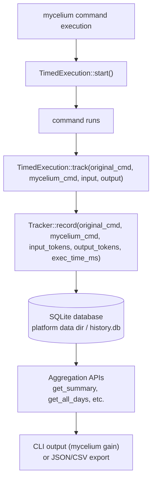

# Mycelium Tracking API Documentation

Comprehensive documentation for Mycelium's token savings tracking system.

## Table of Contents

- [Overview](#overview)
- [Architecture](#architecture)
- [Public API](#public-api)
- [Usage Examples](#usage-examples)
- [Data Formats](#data-formats)
- [Integration Examples](#integration-examples)
- [Database Schema](#database-schema)

## Overview

Mycelium's tracking system records every command execution to provide analytics on token savings. The system:
- Stores command history in a platform-specific SQLite database
- Tracks input/output tokens, savings percentage, and execution time
- Automatically cleans up records older than 90 days
- Provides aggregation APIs (daily/weekly/monthly and project-scoped views)
- Exports to JSON/CSV for external integrations

## Architecture

### Data Flow



### Storage Location

- **Linux**: `~/.local/share/mycelium/history.db`
- **macOS**: `~/Library/Application Support/mycelium/history.db`
- **Windows**: `%LOCALAPPDATA%\mycelium\history.db`

Use `mycelium gain --status` to see the exact database path and whether it came from config, environment, or the platform default.

### Data Retention

Records older than **90 days** are automatically deleted on each write operation to prevent unbounded database growth.

## Public API

### Core Types

#### `Tracker`

Main tracking interface for recording and querying command history.

```rust
pub struct Tracker {
    conn: Connection, // SQLite connection
}

impl Tracker {
    /// Create new tracker instance (opens/creates database)
    pub fn new() -> Result<Self>;

    /// Record a command execution
    pub fn record(
        &self,
        original_cmd: &str,      // Standard command (e.g., "ls -la")
        mycelium_cmd: &str,            // Mycelium command (e.g., "mycelium ls")
        input_tokens: usize,      // Estimated input tokens
        output_tokens: usize,     // Actual output tokens
        exec_time_ms: u64,        // Execution time in milliseconds
    ) -> Result<()>;

    /// Get overall summary statistics
    pub fn get_summary(&self) -> Result<GainSummary>;

    /// Get daily statistics (all days)
    pub fn get_all_days(&self) -> Result<Vec<DayStats>>;

    /// Get weekly statistics (grouped by week)
    pub fn get_by_week(&self) -> Result<Vec<WeekStats>>;

    /// Get monthly statistics (grouped by month)
    pub fn get_by_month(&self) -> Result<Vec<MonthStats>>;

    /// Get recent command history (limit = max records)
    pub fn get_recent(&self, limit: usize) -> Result<Vec<CommandRecord>>;
}
```

#### `GainSummary`

Aggregated statistics across all recorded commands.

```rust
pub struct GainSummary {
    pub total_commands: usize,              // Total commands recorded
    pub total_input: usize,                 // Total input tokens
    pub total_output: usize,                // Total output tokens
    pub total_saved: usize,                 // Total tokens saved
    pub avg_savings_pct: f64,               // Average savings percentage
    pub total_time_ms: u64,                 // Total execution time (ms)
    pub avg_time_ms: u64,                   // Average execution time (ms)
    pub by_command: Vec<(String, usize, usize, f64, u64)>, // Top 10 commands
    pub by_day: Vec<(String, usize)>,       // Last 30 days
}
```

#### `DayStats`

Daily statistics (Serializable for JSON export).

```rust
#[derive(Debug, Serialize)]
pub struct DayStats {
    pub date: String,            // ISO date (YYYY-MM-DD)
    pub commands: usize,         // Commands executed this day
    pub input_tokens: usize,     // Total input tokens
    pub output_tokens: usize,    // Total output tokens
    pub saved_tokens: usize,     // Total tokens saved
    pub savings_pct: f64,        // Savings percentage
    pub total_time_ms: u64,      // Total execution time (ms)
    pub avg_time_ms: u64,        // Average execution time (ms)
}
```

#### `WeekStats`

Weekly statistics (Serializable for JSON export).

```rust
#[derive(Debug, Serialize)]
pub struct WeekStats {
    pub week_start: String,      // ISO date (YYYY-MM-DD)
    pub week_end: String,        // ISO date (YYYY-MM-DD)
    pub commands: usize,
    pub input_tokens: usize,
    pub output_tokens: usize,
    pub saved_tokens: usize,
    pub savings_pct: f64,
    pub total_time_ms: u64,
    pub avg_time_ms: u64,
}
```

#### `MonthStats`

Monthly statistics (Serializable for JSON export).

```rust
#[derive(Debug, Serialize)]
pub struct MonthStats {
    pub month: String,           // YYYY-MM format
    pub commands: usize,
    pub input_tokens: usize,
    pub output_tokens: usize,
    pub saved_tokens: usize,
    pub savings_pct: f64,
    pub total_time_ms: u64,
    pub avg_time_ms: u64,
}
```

#### `CommandRecord`

Individual command record from history.

```rust
pub struct CommandRecord {
    pub timestamp: DateTime<Utc>, // UTC timestamp
    pub mycelium_cmd: String,           // Mycelium command used
    pub saved_tokens: usize,       // Tokens saved
    pub savings_pct: f64,          // Savings percentage
}
```

#### `TimedExecution`

Helper for timing command execution (preferred API).

```rust
pub struct TimedExecution {
    start: Instant,
}

impl TimedExecution {
    /// Start timing a command execution
    pub fn start() -> Self;

    /// Track command with elapsed time
    pub fn track(&self, original_cmd: &str, mycelium_cmd: &str, input: &str, output: &str);

    /// Track passthrough commands (timing-only, no token counting)
    pub fn track_passthrough(&self, original_cmd: &str, mycelium_cmd: &str);
}
```

### Utility Functions

```rust
/// Estimate token count (~4 chars = 1 token)
pub fn estimate_tokens(text: &str) -> usize;

/// Format OsString args for display
pub fn args_display(args: &[OsString]) -> String;

/// Legacy tracking function (deprecated, use TimedExecution)
#[deprecated(note = "Use TimedExecution instead")]
pub fn track(original_cmd: &str, mycelium_cmd: &str, input: &str, output: &str);
```

## Usage Examples

### Basic Tracking

```rust
use mycelium::tracking::{TimedExecution, Tracker};

fn main() -> anyhow::Result<()> {
    // Start timer
    let timer = TimedExecution::start();

    // Execute command
    let input = execute_original_command()?;
    let output = execute_mycelium_command()?;

    // Track execution
    timer.track("ls -la", "mycelium ls", &input, &output);

    Ok(())
}
```

### Querying Statistics

```rust
use mycelium::tracking::Tracker;

fn main() -> anyhow::Result<()> {
    let tracker = Tracker::new()?;

    // Get overall summary
    let summary = tracker.get_summary()?;
    println!("Total commands: {}", summary.total_commands);
    println!("Total saved: {} tokens", summary.total_saved);
    println!("Average savings: {:.1}%", summary.avg_savings_pct);

    // Get daily breakdown
    let days = tracker.get_all_days()?;
    for day in days.iter().take(7) {
        println!("{}: {} commands, {} tokens saved",
            day.date, day.commands, day.saved_tokens);
    }

    // Get recent history
    let recent = tracker.get_recent(10)?;
    for cmd in recent {
        println!("{}: {} saved {:.1}%",
            cmd.timestamp, cmd.mycelium_cmd, cmd.savings_pct);
    }

    Ok(())
}
```

### Passthrough Commands

For commands that stream output or run interactively (no output capture):

```rust
use mycelium::tracking::TimedExecution;

fn main() -> anyhow::Result<()> {
    let timer = TimedExecution::start();

    // Execute streaming command (e.g., git tag --list)
    execute_streaming_command()?;

    // Track timing only (input_tokens=0, output_tokens=0)
    timer.track_passthrough("git tag --list", "mycelium git tag --list");

    Ok(())
}
```

## Data Formats

### JSON Export Schema

`mycelium gain --format json` now emits a versioned contract for dashboard
consumers:

```json
{
  "schema_version": "1.0",
  "summary": { "...": "..." },
  "by_command": [
    {
      "command": "mycelium cargo test",
      "count": 5,
      "input_tokens": 6200,
      "tokens_saved": 5034,
      "avg_savings_pct": 81.2,
      "exec_time_ms": 140
    }
  ]
}
```

When `--history` is present, the JSON export also includes a `history` array of
recent command records. `--daily`, `--weekly`, and `--monthly` continue to add
their respective arrays.

#### DayStats JSON

```json
{
  "date": "2026-02-03",
  "commands": 42,
  "input_tokens": 15420,
  "output_tokens": 3842,
  "saved_tokens": 11578,
  "savings_pct": 75.08,
  "total_time_ms": 8450,
  "avg_time_ms": 201
}
```

#### WeekStats JSON

```json
{
  "week_start": "2026-01-27",
  "week_end": "2026-02-02",
  "commands": 284,
  "input_tokens": 98234,
  "output_tokens": 19847,
  "saved_tokens": 78387,
  "savings_pct": 79.80,
  "total_time_ms": 56780,
  "avg_time_ms": 200
}
```

#### MonthStats JSON

```json
{
  "month": "2026-02",
  "commands": 1247,
  "input_tokens": 456789,
  "output_tokens": 91358,
  "saved_tokens": 365431,
  "savings_pct": 80.00,
  "total_time_ms": 249560,
  "avg_time_ms": 200
}
```

### CSV Export Schema

```csv
date,commands,input_tokens,output_tokens,saved_tokens,savings_pct,total_time_ms,avg_time_ms
2026-02-03,42,15420,3842,11578,75.08,8450,201
2026-02-02,38,14230,3557,10673,75.00,7600,200
2026-02-01,45,16890,4223,12667,75.00,9000,200
```

## Integration Examples

### GitHub Actions - Track Savings in CI

```yaml
# .github/workflows/track-mycelium-savings.yml
name: Track Mycelium Savings

on:
  schedule:
    - cron: '0 0 * * 1'  # Weekly on Monday
  workflow_dispatch:

jobs:
  track-savings:
    runs-on: ubuntu-latest
    steps:
      - name: Install Mycelium
        run: cargo install --git https://github.com/basidiocarp/mycelium

      - name: Export weekly stats
        run: |
          mycelium gain --weekly --format json > mycelium-weekly.json
          cat mycelium-weekly.json

      - name: Upload artifact
        uses: actions/upload-artifact@v3
        with:
          name: mycelium-metrics
          path: mycelium-weekly.json

      - name: Post to Slack
        if: success()
        env:
          SLACK_WEBHOOK: ${{ secrets.SLACK_WEBHOOK }}
        run: |
          SAVINGS=$(jq -r '.[0].saved_tokens' mycelium-weekly.json)
          PCT=$(jq -r '.[0].savings_pct' mycelium-weekly.json)
          curl -X POST -H 'Content-type: application/json' \
            --data "{\"text\":\"📊 Mycelium Weekly: ${SAVINGS} tokens saved (${PCT}%)\"}" \
            $SLACK_WEBHOOK
```

### Custom Dashboard Script

```python
#!/usr/bin/env python3
"""
Export Mycelium metrics to Grafana/Datadog/etc.
"""
import json
import subprocess
from datetime import datetime

def get_mycelium_metrics():
    """Fetch Mycelium metrics as JSON."""
    result = subprocess.run(
        ["mycelium", "gain", "--all", "--format", "json"],
        capture_output=True,
        text=True
    )
    return json.loads(result.stdout)

def export_to_datadog(metrics):
    """Send metrics to Datadog."""
    import datadog

    datadog.initialize(api_key="YOUR_API_KEY")

    for day in metrics.get("daily", []):
        datadog.api.Metric.send(
            metric="mycelium.tokens_saved",
            points=[(datetime.now().timestamp(), day["saved_tokens"])],
            tags=[f"date:{day['date']}"]
        )

        datadog.api.Metric.send(
            metric="mycelium.savings_pct",
            points=[(datetime.now().timestamp(), day["savings_pct"])],
            tags=[f"date:{day['date']}"]
        )

if __name__ == "__main__":
    metrics = get_mycelium_metrics()
    export_to_datadog(metrics)
    print(f"Exported {len(metrics.get('daily', []))} days to Datadog")
```

### Rust Integration (Using Mycelium as Library)

```rust
// In your Cargo.toml
// [dependencies]
// mycelium = { git = "https://github.com/basidiocarp/mycelium" }

use mycelium::tracking::{Tracker, TimedExecution};
use anyhow::Result;

fn main() -> Result<()> {
    // Track your own commands
    let timer = TimedExecution::start();

    let input = run_expensive_operation()?;
    let output = run_optimized_operation()?;

    timer.track(
        "expensive_operation",
        "optimized_operation",
        &input,
        &output
    );

    // Query aggregated stats
    let tracker = Tracker::new()?;
    let summary = tracker.get_summary()?;

    println!("Total savings: {} tokens ({:.1}%)",
        summary.total_saved,
        summary.avg_savings_pct
    );

    // Export to JSON for external tools
    let days = tracker.get_all_days()?;
    let json = serde_json::to_string_pretty(&days)?;
    std::fs::write("metrics.json", json)?;

    Ok(())
}
```

## Database Schema

### Table: `commands`

```sql
CREATE TABLE commands (
    id INTEGER PRIMARY KEY,
    timestamp TEXT NOT NULL,           -- RFC3339 UTC timestamp
    original_cmd TEXT NOT NULL,        -- Original command (e.g., "ls -la")
    mycelium_cmd TEXT NOT NULL,             -- Mycelium command (e.g., "mycelium ls")
    input_tokens INTEGER NOT NULL,     -- Estimated input tokens
    output_tokens INTEGER NOT NULL,    -- Actual output tokens
    saved_tokens INTEGER NOT NULL,     -- input_tokens - output_tokens
    savings_pct REAL NOT NULL,         -- (saved/input) * 100
    exec_time_ms INTEGER DEFAULT 0     -- Execution time in milliseconds
);

CREATE INDEX idx_timestamp ON commands(timestamp);
```

### Automatic Cleanup

On every write operation (`Tracker::record`), records older than 90 days are deleted:

```rust
fn cleanup_old(&self) -> Result<()> {
    let cutoff = Utc::now() - chrono::Duration::days(90);
    self.conn.execute(
        "DELETE FROM commands WHERE timestamp < ?1",
        params![cutoff.to_rfc3339()],
    )?;
    Ok(())
}
```

### Migration Support

The system automatically adds new columns if they don't exist (e.g., `exec_time_ms` was added later):

```rust
// Safe migration on Tracker::new()
let _ = conn.execute(
    "ALTER TABLE commands ADD COLUMN exec_time_ms INTEGER DEFAULT 0",
    [],
);
```

## Performance Considerations

- **SQLite WAL mode**: Not enabled (may add in future for concurrent writes)
- **Index on timestamp**: Enables fast date-range queries
- **Automatic cleanup**: Prevents database from growing unbounded
- **Token estimation**: ~4 chars = 1 token (simple, fast approximation)
- **Aggregation queries**: Use SQL GROUP BY for efficient aggregation

## Security & Privacy

- **Local storage only**: Database never leaves the machine
- **No telemetry**: Mycelium does not phone home (telemetry was removed)
- **User control**: Users can delete the resolved tracking database anytime
- **90-day retention**: Old data automatically purged

## Troubleshooting

### Database locked error

If you see "database is locked" errors:
- Ensure only one Mycelium process writes at a time
- Check file permissions on the resolved database path from `mycelium gain --status`
- Delete and recreate the resolved database file, then run `mycelium gain`

### Missing exec_time_ms column

Older databases may not have the `exec_time_ms` column. Mycelium automatically migrates on first use, but you can force it:

```bash
sqlite3 <resolved-history.db-path> \
  "ALTER TABLE commands ADD COLUMN exec_time_ms INTEGER DEFAULT 0"
```

### Incorrect token counts

Token estimation uses `~4 chars = 1 token`. This is approximate. For precise counts, integrate with your LLM's tokenizer API.

## Future Enhancements

Planned improvements:

- [ ] Export to Prometheus/OpenMetrics format
- [ ] Support for custom retention periods (not just 90 days)
- [ ] SQLite WAL mode for concurrent writes
- [ ] Better per-project spend attribution for `mycelium economics`
- [ ] Integration with Claude API for precise token counts
- [ ] Web dashboard (localhost) for visualizing trends

## See Also

- [README.md](../README.md) - Main project documentation
- [FEATURES.md](FEATURES.md) - Complete feature documentation
- [Rust docs](https://docs.rs/) - Run `cargo doc --open` for API docs
