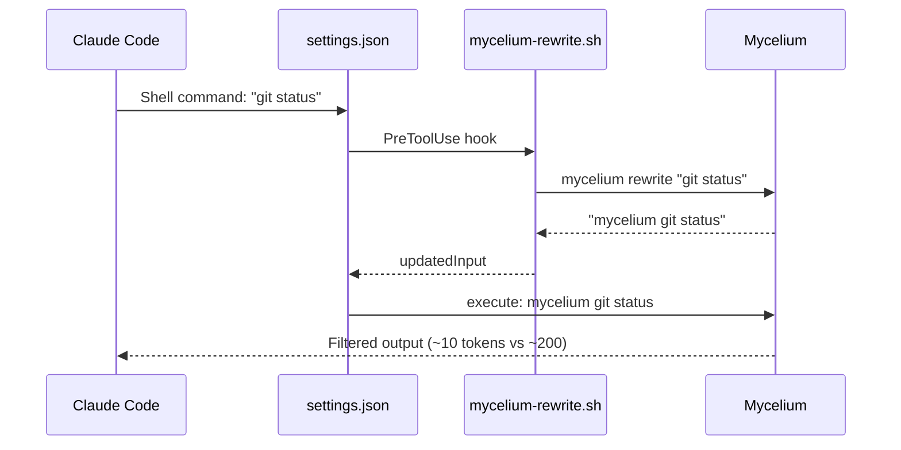

# Mycelium Analytics, Hooks, and Configuration

> Analytics commands, hook system, configuration options, and the tee system. For command reference, see [commands.md](commands.md).

---

## Table of Contents

1. [Analytics and Tracking](#analytics-and-tracking)
2. [Hook System](#hook-system)
3. [Configuration](#configuration)
4. [Tee System (Output Recovery)](#tee-system)

---

## Analytics and Tracking

### Tracking System

Mycelium records each command execution in a SQLite database:

- **Location:** `~/.local/share/mycelium/history.db` (Linux), `~/Library/Application Support/mycelium/history.db` (macOS), `%LOCALAPPDATA%\\mycelium\\history.db` (Windows)
- **Retention:** 90-day automatic cleanup
- **Metrics:** input/output tokens, savings percentage, execution time, project

Use `mycelium gain --status` to inspect the resolved path on the current machine.

---

### `mycelium gain` -- Savings Statistics

```bash
mycelium gain                        # Global summary
mycelium gain -p                     # Filter by current project
mycelium gain --graph                # ASCII graph (last 30 days)
mycelium gain --history              # Recent command history
mycelium gain --daily                # Day-by-day breakdown
mycelium gain --weekly               # Week-by-week breakdown
mycelium gain --monthly              # Month-by-month breakdown
mycelium gain --all                  # All breakdowns
mycelium gain --quota -t pro         # Estimated savings on monthly quota
mycelium gain --failures             # Parsing failure log (fallback commands)
mycelium gain --diagnostics          # Rewrite quality + passthrough diagnostics
mycelium gain --diagnostics --explain # Explain diagnostic scoring and scope
mycelium gain --format json          # JSON export (for dashboards)
mycelium gain --history --limit 50 --format json  # Recent history JSON for Cap
mycelium gain --format csv           # CSV export
```

**Options:**

| Option | Short | Description |
|--------|-------|-------------|
| `--project` | `-p` | Filter by current directory |
| `--graph` | `-g` | ASCII graph of last 30 days |
| `--history` | `-H` | Recent command history |
| `--limit` | — | Max entries for recent history and by-command JSON exports (default: `10`) |
| `--quota` | `-q` | Estimated savings on monthly quota |
| `--tier` | `-t` | Subscription tier: `pro`, `5x`, `20x` (default: `20x`) |
| `--diagnostics` | — | Rewrite coverage, parse recovery, and passthrough diagnostics |
| `--explain` | — | With `--diagnostics`, explain diagnostic scoring and scope |
| `--daily` | `-d` | Daily breakdown |
| `--weekly` | `-w` | Weekly breakdown |
| `--monthly` | `-m` | Monthly breakdown |
| `--all` | `-a` | All breakdowns |
| `--format` | `-f` | Output format: `text`, `json`, `csv` |
| `--failures` | `-F` | Show fallback commands |

### Diagnostics notes

- quality score, hook coverage, and parse recovery are global
- passthrough summaries honor `--project` / `--project-path`
- diagnostics output is text-only; it does not support `--format json` or `--format csv`
- JSON exports include `schema_version`, `summary`, and `by_command`; `--history` adds a `history` array and `--daily` adds `daily`

**Example output:**
```text
$ mycelium gain
Mycelium Token Savings Summary
  Total commands:     1,247
  Total input:        2,341,000 tokens
  Total output:       468,200 tokens
  Total saved:        1,872,800 tokens (80%)
  Avg per command:    1,501 tokens saved

Top commands:
  git status    312x  -82%
  cargo test    156x  -91%
  git diff       98x  -76%
```

---

### `mycelium discover` -- Missed Opportunities

Analyzes Claude Code history to find commands that could have been optimized by mycelium.

```bash
mycelium discover                          # Current project, last 30 days
mycelium discover --all --since 7          # All projects, last 7 days
mycelium discover -p /path/to/project      # Filter by project
mycelium discover --limit 20              # Max commands per section
mycelium discover --format json            # JSON export
```

**Options:**

| Option | Short | Description |
|--------|-------|-------------|
| `--project` | `-p` | Filter by project path |
| `--limit` | `-l` | Max commands per section (default: 15) |
| `--all` | `-a` | Scan all projects |
| `--since` | `-s` | Last N days (default: 30) |
| `--format` | `-f` | Format: `text`, `json` |

---

### `mycelium learn` -- Learn from Errors

Analyzes Claude Code CLI error history to detect recurring corrections.

```bash
mycelium learn                             # Current project
mycelium learn --all --since 7             # All projects
mycelium learn --write-rules               # Generate .claude/rules/cli-corrections.md
mycelium learn --min-confidence 0.8        # Confidence threshold (default: 0.6)
mycelium learn --min-occurrences 3         # Minimum occurrences (default: 1)
mycelium learn --format json               # JSON export
```

---

### `mycelium economics` -- Claude Code Economic Analysis

Compares Claude Code spending (via ccusage) with Mycelium savings.

```bash
mycelium economics                         # Summary
mycelium economics --project               # Current project savings, global ccusage spend
mycelium economics --project-path .        # Specific project savings scope
mycelium economics --daily                 # Daily breakdown
mycelium economics --weekly                # Weekly breakdown
mycelium economics --monthly               # Monthly breakdown
mycelium economics --all                   # All breakdowns
mycelium economics --format json           # JSON export
mycelium cc-economics                      # Compatibility alias
```

**Notes:**

- `--project` and `--project-path` scope the Mycelium savings side of the report.
- Claude Code spend from `ccusage` remains global because `ccusage` does not currently expose per-project attribution.
- The long-term contract boundary for usage and cost inputs is `septa/usage-event-v1.schema.json`; Mycelium should consume normalized usage events or deterministic summaries over that shape instead of growing host-specific parsing rules in UI-facing surfaces.

---

### `mycelium hook-audit` -- Hook Metrics

Requires `MYCELIUM_HOOK_AUDIT=1` in the environment.

```bash
mycelium hook-audit                        # Last 7 days (default)
mycelium hook-audit --since 30             # Last 30 days
mycelium hook-audit --since 0              # Full history
```

---

## Hook System

### How It Works

The Mycelium hook intercepts shell commands in Claude Code before execution and rewrites them into their Mycelium equivalent.



- Claude never sees the rewrite—it receives optimized output directly.
- The hook is a thin delegator that calls `mycelium rewrite`.
- Rewrite decisions live in the Rust registry modules (`src/discover/registry.rs` and `src/discover/registry_parser.rs`).
- Commands already prefixed with `mycelium` pass through unchanged.
- Commands with risky shell syntax like pipes, redirects, command substitution, subshells, or process substitution pass through unchanged.
- Unrecognized commands pass through unchanged.

### Installation

```bash
mycelium init -g                     # Recommended installation (hook + Mycelium.md)
mycelium init -g --auto-patch        # Non-interactive (CI/CD)
mycelium init -g --hook-only         # Hook only, without Mycelium.md
mycelium init --show                 # Check installation
mycelium init -g --uninstall         # Uninstall
```

### Installed Files

| File | Description |
|------|-------------|
| `~/.claude/hooks/mycelium-rewrite.sh` | Hook script (delegates to `mycelium rewrite`) |
| `~/.claude/Mycelium.md` | Minimal instructions for the LLM |
| `~/.claude/settings.json` | PreToolUse hook registration |

### `mycelium rewrite` -- Command Rewriting

Internal command used by the hook. Prints the rewritten command to stdout (exit 0) or exits with exit 1 if no Mycelium equivalent exists.

```bash
mycelium rewrite "git status"           # -> "mycelium git status" (exit 0)
mycelium rewrite --explain "git status" # Show rewrite reason + estimated savings
mycelium rewrite "terraform plan"       # -> (exit 1, no rewrite)
mycelium rewrite "mycelium git status"       # -> "mycelium git status" (exit 0, unchanged)
```

### `mycelium verify` -- Integrity Check

Verifies the integrity of the installed hook via SHA-256 checksum.

```bash
mycelium verify
```

### Automatically Rewritten Commands

| Raw command | Rewritten to |
|-------------|--------------|
| `git status/diff/log/add/commit/push/pull` | `mycelium git ...` |
| `gh pr/issue/run` | `mycelium gh ...` |
| `cargo test/build/clippy/check` | `mycelium cargo ...` |
| `cat/head/tail <file>` | `mycelium read <file>` |
| `rg/grep <pattern>` | `mycelium grep <pattern>` |
| `ls` | `mycelium ls` |
| `tree` | `mycelium tree` |
| `wc` | `mycelium wc` |
| `vitest/jest` | `mycelium vitest run` |
| `tsc` | `mycelium tsc` |
| `eslint/biome` | `mycelium lint` |
| `prettier` | `mycelium prettier` |
| `playwright` | `mycelium playwright` |
| `prisma` | `mycelium prisma` |
| `ruff check/format` | `mycelium ruff ...` |
| `pytest` | `mycelium pytest` |
| `mypy` | `mycelium mypy` |
| `pip list/install` | `mycelium pip ...` |
| `go test/build/vet` | `mycelium go ...` |
| `golangci-lint` | `mycelium golangci-lint` |
| `docker ps/images/logs` | `mycelium docker ...` |
| `kubectl get/logs` | `mycelium kubectl ...` |
| `curl` | `mycelium curl` |
| `pnpm list/outdated` | `mycelium pnpm ...` |

### Command Exclusion

To prevent certain commands from being rewritten, add them to `config.toml`:

```toml
[hooks]
exclude_commands = ["curl", "playwright"]
```

---

## Configuration

### Configuration File

**Location:** `~/.config/mycelium/config.toml` (Linux) or `~/Library/Application Support/mycelium/config.toml` (macOS)

**Commands:**
```bash
mycelium config                # Show current configuration
mycelium config --create       # Create file with default values
```

### Full Structure

```toml
[tracking]
enabled = true              # Enable/disable tracking
history_days = 90           # Retention days (automatic cleanup)
database_path = "/custom/path/history.db"  # Custom path (optional)

[display]
colors = true               # Colored output
emoji = true                # Use emojis
max_width = 120             # Maximum output width

[filters]
ignore_dirs = [".git", "node_modules", "target", "__pycache__", ".venv", "vendor"]
ignore_files = ["*.lock", "*.min.js", "*.min.css"]

[tee]
enabled = true              # Enable raw output saving
mode = "failures"           # "failures" (default), "always", or "never"
max_files = 20              # Rotation: keep the last N files
# directory = "/custom/tee/path"  # Custom path (optional)

[hooks]
exclude_commands = []       # Commands to exclude from automatic rewriting
```

### Environment Variables

| Variable | Description |
|----------|-------------|
| `MYCELIUM_TEE_DIR` | Override the tee directory |
| `MYCELIUM_HOOK_AUDIT=1` | Enable hook auditing |
| `SKIP_ENV_VALIDATION=1` | Disable env validation (Next.js, etc.) |

---

## Tee System

### Raw Output Recovery

When a command exits non-zero, Mycelium saves the complete raw output to a log file so the LLM can read it without re-executing the command. The sequence is:

1. Save raw output to the resolved tee directory (platform data dir by default, or `MYCELIUM_TEE_DIR`).
2. Display the file path in the filtered output.
3. Leave the file available for the LLM to read if more details are needed.

Example output:
```
FAILED: 2/15 tests
[full output: <resolved tee dir>/1707753600_cargo_test.log]
```

Configuration:

| Parameter | Default | Description |
|-----------|---------|-------------|
| `tee.enabled` | `true` | Enable/disable |
| `tee.mode` | `"failures"` | `"failures"`, `"always"`, `"never"` |
| `tee.max_files` | `20` | Rotation: keep the last N files |
| Min size | 500 bytes | Outputs that are too short are not saved |
| Max file size | 1 MB | Truncated beyond this |
